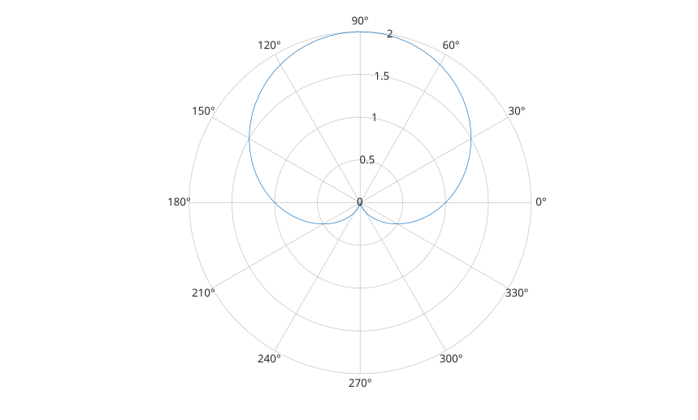

# polaraxes

Cree des axes configures pour les traces polaires.

## 📝 Syntaxe

- polaraxes()
- polaraxes(propertyName, propertyValue, ...)
- ax = polaraxes(...)

## 📥 Argument d'entrée

- propertyName - Nom de propriete d'axes : chaine scalaire ou vecteur ligne de caracteres.
- propertyValue - Valeur affectee a la propriete d'axes precedente.

## 📤 Argument de sortie

- ax - Objet graphique axes initialise pour les traces polaires.

## 📄 Description


<b>polaraxes</b> cree un objet axes et l'initialise pour le rendu en coordonnees polaires. 

L'etat polaire est stocke sur l'axes et contient les limites radiales, les limites angulaires, les graduations, les etiquettes, les handles de grille et les handles de donnees tracees. 

L'objet reste un objet graphique axes. Utiliser <b>polarplot</b> pour ajouter des donnees polaires, puis <b>rlim</b>, <b>rticks</b>, <b>rticklabels</b>, <b>thetalim</b>, <b>thetaticks</b> et <b>thetaticklabels</b> pour personnaliser les decorations polaires. 

Voir [proprietes de polaraxes](../../../graphics/2_graphics_objects/4_properties/nelson.graphics.polaraxes.properties.md) pour la liste complete des proprietes.

## 💡 Exemple

Creer un axes polaire et tracer dedans.

```matlab

ax = polaraxes();
theta = linspace(0, 2*pi, 80);
polarplot(ax, theta, 1 + sin(theta));
rlim(ax, [0 2]);

```



## 🔗 Voir aussi

[proprietes de polaraxes](../../../graphics/2_graphics_objects/4_properties/nelson.graphics.polaraxes.properties.md), [polarplot](../../../graphics/1_plots/2_polar_plots/polarplot.md), [axes](../../../graphics/2_graphics_objects/1_object_management/axes.md), [rlim](../../../graphics/3_labels_styling/1_axes_appearance/rlim.md), [thetalim](../../../graphics/3_labels_styling/1_axes_appearance/thetalim.md).

## 🕔 Historique

| Version | 📄 Description     |
| ------- | --------------- |
| 2.0.0   | version initiale |

<!--
## 👤 Auteur

Allan CORNET
-->
