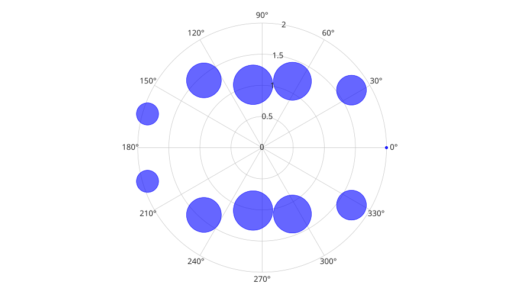
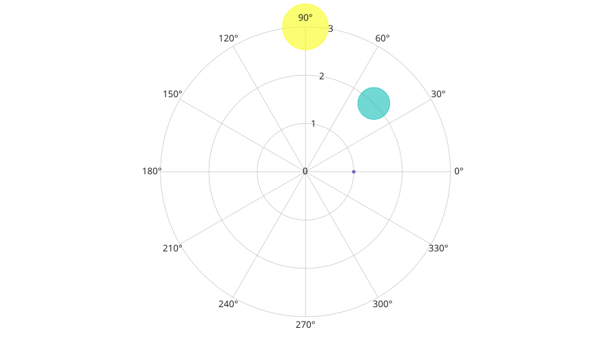

# polarbubblechart

Affiche un graphique a bulles en coordonnees polaires.

## 📝 Syntaxe

- polarbubblechart(theta, rho, taille)
- polarbubblechart(theta, rho, taille, couleur)
- polarbubblechart(tbl, thetavar, rhovar, taillevar)
- polarbubblechart(tbl, thetavar, rhovar, taillevar, couleurvar)
- polarbubblechart(parent, ...)
- h = polarbubblechart(...)

## 📄 Description

<b>polarbubblechart</b> affiche des marqueurs polaires dont la taille depend des donnees de bulles.

L'entree table selectionne les donnees d'angle, de rayon, de taille et de couleur optionnelle depuis les variables de <b>tbl</b>. Plusieurs variables selectionnees creent plusieurs objets <b>bubblechart</b>.

## 💡 Exemples

Creer un graphique a bulles polaire.

```matlab
theta = linspace(0, 2*pi, 12);
rho = 1 + cos(theta).^2;
taille = 20 + 60 * abs(sin(theta));
polarbubblechart(theta, rho, taille, 'b');
```


Creer un graphique a bulles polaire depuis une table.

```matlab
t = table([0; pi/4; pi/2], [1; 2; 3], [25; 36; 49], [1; 2; 3], ...
  'VariableNames', {'theta', 'rho', 'sz', 'c'});
h = polarbubblechart(t, 'theta', 'rho', 'sz', 'c');
```



## 🔗 Voir aussi

[bubblechart](../../../graphics/1_plots/4_data_distribution_plots/bubblechart.md), [polarscatter](../../../graphics/1_plots/2_polar_plots/polarscatter.md).
