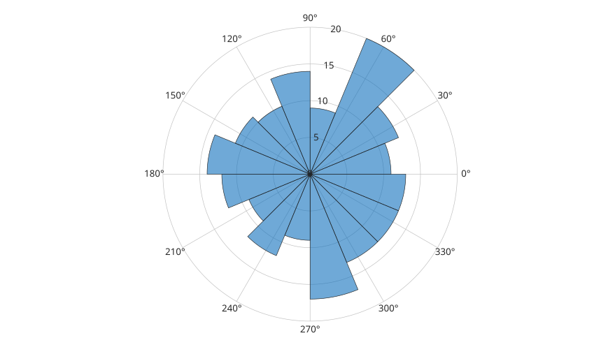

# polarhistogram

Affiche des angles sous forme d'histogramme polaire.

## 📝 Syntaxe

- polarhistogram(theta)
- polarhistogram(theta, nbins)
- polarhistogram(..., 'BinEdges', edges)
- h = polarhistogram(...)

## 📄 Description


<b>polarhistogram</b> regroupe des angles en classes et affiche les effectifs sous forme de secteurs polaires.

## 💡 Exemple

Creer un histogramme polaire.

```matlab
theta = 2*pi*rand(200, 1);
polarhistogram(theta, 16);
```



## 🔗 Voir aussi

[histogram](../../../graphics/1_plots/4_data_distribution_plots/histogram.md), [polarplot](../../../graphics/1_plots/2_polar_plots/polarplot.md).