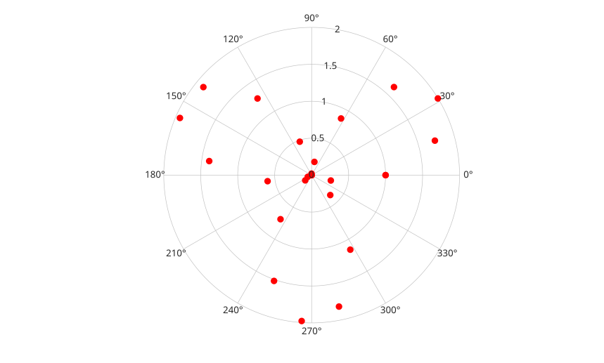

# polarscatter

Affiche des points en coordonnees polaires.

## 📝 Syntaxe

- polarscatter(theta, rho)
- polarscatter(theta, rho, taille)
- polarscatter(theta, rho, taille, couleur)
- polarscatter(tbl, thetavar, rhovar)
- polarscatter(parent, ...)
- h = polarscatter(...)

## 📄 Description


<b>polarscatter</b> affiche des marqueurs a partir de valeurs d'angle et de rayon. 

L'entree table selectionne les donnees d'angle et de rayon depuis les variables de <b>tbl</b>. Plusieurs variables selectionnees creent plusieurs objets <b>scatter</b>.

## 💡 Exemples

Afficher des marqueurs polaires remplis.

```matlab
theta = linspace(0, 2*pi, 24);
rho = 1 + sin(3 * theta);
polarscatter(theta, rho, 49, 'r', 'filled');
```

Creer un nuage polaire depuis une table.

```matlab
t = table([0; pi/4; pi/2], [1; 2; 3], 'VariableNames', {'theta', 'rho'});
h = polarscatter(t, 'theta', 'rho', 'filled');
```


## 🔗 Voir aussi

[polarplot](../../../graphics/1_plots/2_polar_plots/polarplot.md), [polarbubblechart](../../../graphics/1_plots/2_polar_plots/polarbubblechart.md).