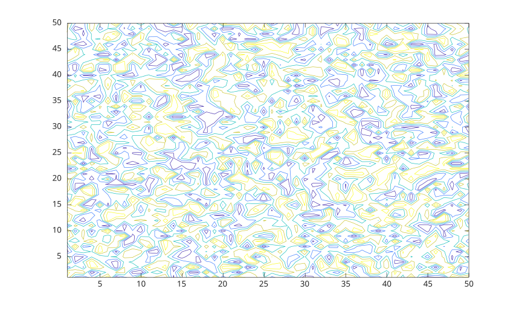
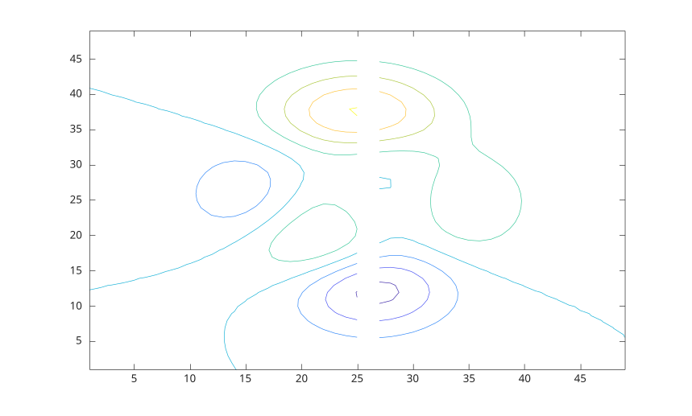

# contour

Tracé de contours d'une matrice

## 📝 Syntaxe

- contour(Z)
- contour(X, Y, Z)
- contour(..., levels)
- contour(..., LineSpec)
- contour(ax, ...)
- M = contour(...)
- [M, h] = contour(...)

## 📥 Argument d'entrée

- X - Coordonnées x : vecteur ou matrice.
- Y - Coordonnées y : vecteur ou matrice.
- Z - Coordonnées z : vecteur ou matrice.
- levels - Niveaux de contours : scalaire ou vecteur.
- LineSpec - Style et couleur de ligne
- ax - Un objet graphique scalaire : conteneur parent, spécifié comme axes.

## 📤 Argument de sortie

- M - Matrice de contours.
- h - Un objet graphique : type contour.

## 📄 Description


<b>contour(Z)</b> génère un tracé de contours représentant les isolignes de la matrice Z. Chaque isoligne correspond à une valeur de hauteur spécifique sur le plan x-y. 

Nelson sélectionne automatiquement les lignes de contour à afficher en fonction des valeurs de Z. Les indices de colonnes et de lignes de Z servent respectivement de coordonnées x et y dans le plan. 

<b>contour(X, Y, Z)</b> permet à l'utilisateur de spécifier les coordonnées x et y correspondant aux valeurs de la matrice Z. Cela permet un contrôle plus précis du positionnement du tracé de contours sur le plan x-y. 

Les matrices X et Y fournissent les coordonnées, tandis que Z contient les valeurs de hauteur pour générer le tracé de contours. 

Voir [proprietes de contour](../../../graphics/2_graphics_objects/4_properties/nelson.graphics.contour.properties.md) pour la liste complete des proprietes.

## 💡 Exemples


```matlab
f = figure();
    subplot(2, 3, 1)
    x = linspace(-2 * pi, 2 * pi);
    y = linspace(0, 4 * pi);
    [X, Y] = meshgrid(x, y);
    Z = sin(X) + cos(Y);
    contour(X, Y, Z);
    subplot(2, 3, 2)
    [X, Y, Z] = peaks;
    contour(X, Y, Z, 20)
    subplot(2, 3, 3)
    [X, Y, Z] = peaks;
    v = [1,1];
    contour(X, Y, Z, v)
    subplot(2, 3, 4)
    [X, Y, Z] = peaks;
    contour(X, Y, Z, '-.')
    subplot(2, 3, 5)
    Z = peaks;
    [M, c] = contour(Z);
    c.LineWidth = 3;
    subplot(2, 3, 6)
    [theta, r] = meshgrid (linspace (0,2*pi,64), linspace (0,1,64));
    [X, Y] = pol2cart (theta, r);
    Z = sin (2*theta) .* (1-r);
    contour (X, Y, abs (Z), 10);
```


```matlab
rng('default');
    f = figure();
    N = 50;
    contour(1:N, 1:N, rand(N), 5) 
```



```matlab
f = figure();
    Z = peaks;
    Z(:,26) = NaN;
    contour(Z)
```

Lignes de contour avec etiquettes.

```matlab

[X, Y, Z] = peaks;

[C, h] = contour(X, Y, Z);

clabel(C, h);

```


## 🔗 Voir aussi

[proprietes de contour](../../../graphics/2_graphics_objects/4_properties/nelson.graphics.contour.properties.md), [contourc](../../../graphics/1_plots/3_contour_plots/contourc.md), [contourf](../../../graphics/1_plots/3_contour_plots/contourf.md), [contour3](../../../graphics/1_plots/3_contour_plots/contour3.md), [clabel](../../../graphics/1_plots/3_contour_plots/clabel.md), [surf](../../../graphics/1_plots/7_surfaces_volumes_polygons/surf.md), [mesh](../../../graphics/1_plots/7_surfaces_volumes_polygons/mesh.md).

## 🕔 Historique

| Version | 📄 Description     |
| ------- | --------------- |
| 1.3.0   | version initiale |
| 1.7.0   | Ajout des callbacks CreateFcn, DeleteFcn. |
| --   | Ajout de la propriete BeingDeleted. |

<!--
## 👤 Auteur

Allan CORNET
-->
