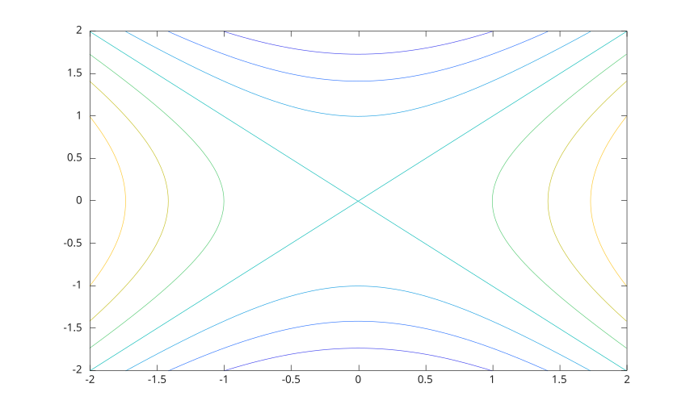

# fcontour

Tracer des contours depuis une fonction de deux variables.

## 📝 Syntaxe

- fcontour(fun)
- fcontour(fun, xyinterval)
- fcontour(fun, [xmin xmax ymin ymax])
- fcontour(..., LineSpec)
- fcontour(..., nomPropriete, valeurPropriete)
- fcontour(parent, ...)
- h = fcontour(...)

## 📄 Description


<b>fcontour</b> echantillonne <b>fun(x,y)</b> sur une grille reguliere et affiche des lignes de contour comme objet graphique <b>functioncontour</b>. 

Voir [proprietes de functioncontour](../../../graphics/2_graphics_objects/4_properties/nelson.graphics.functioncontour.properties.md) pour la liste complete des proprietes.

## 💡 Exemples

Afficher des contours de fonction.

```matlab
fcontour(@(x, y) x.^2 - y.^2, [-2 2 -2 2]);
```

Utiliser une couleur de ligne et des niveaux explicites.

```matlab
h = fcontour(@(x, y) x + y, '-r', 'LevelList', [-2 0 2]);
h.LineWidth = 1.5;
```


## 🔗 Voir aussi

[proprietes de functioncontour](../../../graphics/2_graphics_objects/4_properties/nelson.graphics.functioncontour.properties.md), [contour](../../../graphics/1_plots/3_contour_plots/contour.md), [fmesh](../../../graphics/1_plots/7_surfaces_volumes_polygons/fmesh.md).