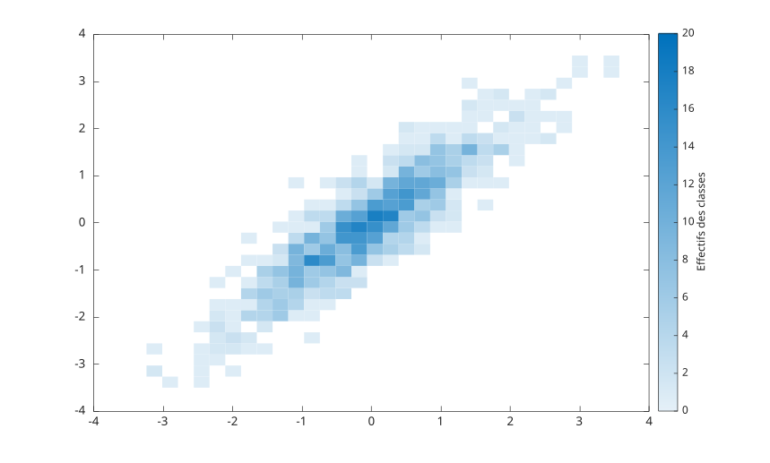

# binscatter

Afficher un nuage de points regroupe par bins.

## 📝 Syntaxe

- binscatter(x, y)
- binscatter(x, y, n)
- binscatter(..., 'XLimits', limites, 'YLimits', limites)
- binscatter(..., Nom, Valeur)
- binscatter(parent, ...)
- h = binscatter(...)

## 📄 Description


<b>binscatter</b> compte les points dans des bins bidimensionnels et affiche les comptes avec un objet graphique natif binscatter. 

<b>Values</b>, <b>XBinEdges</b> et <b>YBinEdges</b> sont des proprietes calculees en lecture seule. 

Lorsque les axes sont zoomes, le chart recalcule des bins plus petits afin que la region visible conserve approximativement la densite de bins demandee. 

Voir [proprietes de binscatter](../../../graphics/2_graphics_objects/4_properties/nelson.graphics.binscatter.properties.md) pour la liste complete des proprietes.

## 💡 Exemples

Afficher une densite de points par bins.

```matlab
x = randn(1000, 1);
y = x + 0.5 * randn(1000, 1);
h = binscatter(x, y, [30 30]);
h.FaceAlpha = 0.9;
```

Inspecter les valeurs et les bords de bins calcules.

```matlab
x = [0.1 0.2 0.8 1.2 1.8 1.9];
y = [0.1 0.9 0.8 1.2 1.1 1.9];
h = binscatter(x, y, [2 2], 'XLimits', [0 2], 'YLimits', [0 2]);
h.Values
h.XBinEdges
h.YBinEdges
```


## 🔗 Voir aussi

[proprietes de binscatter](../../../graphics/2_graphics_objects/4_properties/nelson.graphics.binscatter.properties.md), [scatter](../../../graphics/1_plots/4_data_distribution_plots/scatter.md), [histogram2](../../../graphics/1_plots/4_data_distribution_plots/histogram2.md).