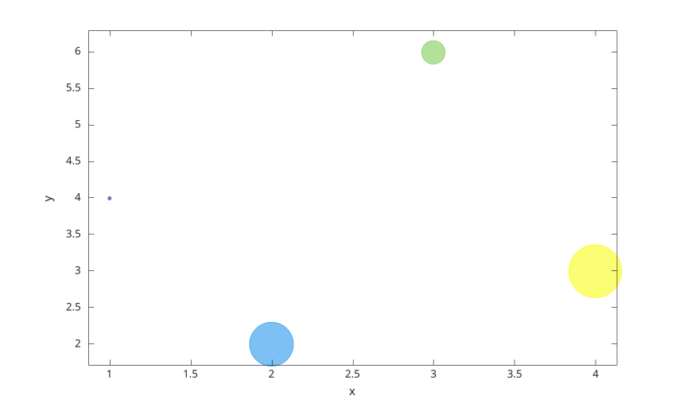

# bubblechart

Afficher un graphique a bulles.

## 📝 Syntaxe

- bubblechart(x, y, sz)
- bubblechart(x, y, sz, c)
- bubblechart(tbl, xvar, yvar, sizevar)
- bubblechart(tbl, xvar, yvar, sizevar, cvar)
- bubblechart(parent, ...)
- bubblechart(..., propertyName, propertyValue)
- h = bubblechart(...)

## 📄 Description


<b>bubblechart</b> affiche un graphique dont les tailles des marqueurs circulaires sont controlees par <b>sz</b>. 

<b>x</b>, <b>y</b> et <b>sz</b> peuvent etre des vecteurs ou des matrices. Avec <b>x</b> et <b>y</b> vectoriels et <b>sz</b> scalaire, un objet bubblechart est cree pour chaque point. Les matrices creent un objet par serie de donnees. 

<b>c</b> specifie les couleurs des bulles. Cette valeur peut etre un nom de couleur, un nom court, un triplet RGB, un vecteur de couleurs ou une matrice RGB. 

La syntaxe table lit les variables depuis <b>tbl</b>. Les selecteurs de variables peuvent etre des noms, des tableaux de chaines, des cellules de noms, des indices numeriques ou des vecteurs logiques. 

Voir [proprietes de bubblechart](../../../graphics/2_graphics_objects/4_properties/nelson.graphics.bubblechart.properties.md) pour la liste complete des proprietes.

## 💡 Exemples

Afficher un graphique a bulles.

```matlab
bubblechart(1:5, [3 5 2 8 4], [20 50 30 80 40], 'BubbleColor', 'r');
```

Afficher plusieurs series depuis des matrices.

```matlab
x = [1 2 3; 4 5 6];
y = [2 4 3; 5 6 4];
sz = [20 40 60; 50 30 70];
bubblechart(x, y, sz);
```

Utiliser des variables de table.

```matlab
t = table((1:4)', [4; 2; 6; 3], [20; 60; 30; 80], [1; 2; 3; 4], ...
  'VariableNames', {'x', 'y', 's', 'c'});
bubblechart(t, 'x', 'y', 's', 'c');
```



## 🔗 Voir aussi

[proprietes de bubblechart](../../../graphics/2_graphics_objects/4_properties/nelson.graphics.bubblechart.properties.md), [scatter](../../../graphics/1_plots/4_data_distribution_plots/scatter.md), [bubblechart3](../../../graphics/1_plots/4_data_distribution_plots/bubblechart3.md).