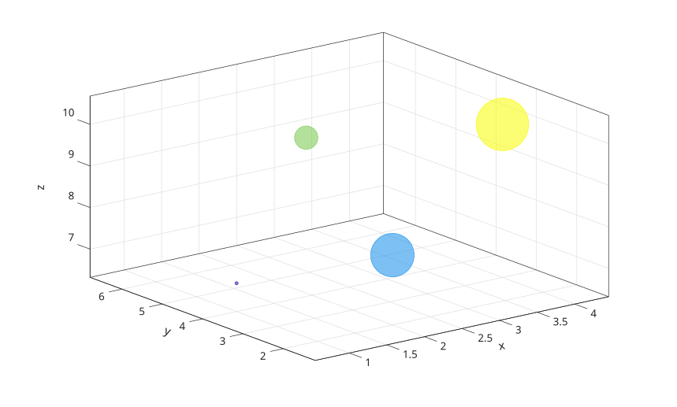

# bubblechart3

Afficher un graphique a bulles 3-D.

## 📝 Syntaxe

- bubblechart3(x, y, z, sz)
- bubblechart3(x, y, z, sz, c)
- bubblechart3(tbl, xvar, yvar, zvar, szvar)
- bubblechart3(tbl, xvar, yvar, zvar, szvar, cvar)
- bubblechart3(parent, ...)
- bubblechart3(..., propertyName, propertyValue)
- h = bubblechart3(...)

## 📄 Description

<b>bubblechart3</b> affiche un nuage de points 3-D dont les tailles de marqueurs sont controlees par <b>sz</b>.

<b>c</b> specifie les couleurs des bulles. Il peut s'agir d'un nom de couleur, d'un nom court, d'un triplet RGB, d'un vecteur de couleurs ou d'une matrice RGB.

L'entree table selectionne les donnees depuis les variables de <b>tbl</b>. Chaque selecteur peut etre un nom de variable, une string, un indice, un selecteur logique, ou un vecteur cellule/string de noms. Plusieurs variables selectionnees creent plusieurs objets <b>bubblechart</b>.

Le handle retourne est un objet <b>bubblechart</b> avec <b>XData</b>, <b>YData</b>, <b>ZData</b> et <b>SizeData</b>.

Voir [proprietes de bubblechart](../../../graphics/2_graphics_objects/4_properties/nelson.graphics.bubblechart.properties.md) pour la liste complete des proprietes.

## 💡 Exemples

Afficher un graphique a bulles 3-D.

```matlab
t = 0:0.4:2*pi;
bubblechart3(cos(t), sin(t), t, 30 + 20 * t, 'b');
```


Creer un graphique a bulles 3-D depuis une table.

```matlab
t = table((1:4)', [4; 2; 6; 3], [7; 8; 9; 10], [20; 60; 30; 80], [1; 2; 3; 4], ...
  'VariableNames', {'x', 'y', 'z', 's', 'c'});
h = bubblechart3(t, 'x', 'y', 'z', 's', 'c');
```



## 🔗 Voir aussi

[proprietes de bubblechart](../../../graphics/2_graphics_objects/4_properties/nelson.graphics.bubblechart.properties.md), [scatter3](../../../graphics/1_plots/4_data_distribution_plots/scatter3.md), [bubblechart](../../../graphics/1_plots/4_data_distribution_plots/bubblechart.md).
