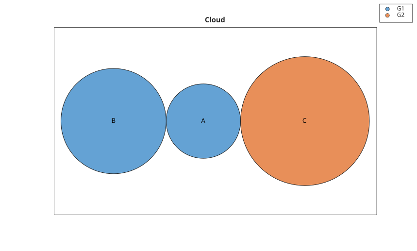
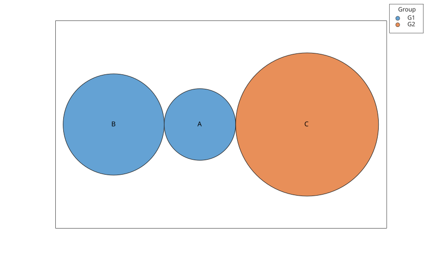

# bubblecloud

Afficher des bulles etiquetees dans une disposition en nuage.

## 📝 Syntaxe

- bubblecloud(sizes)
- bubblecloud(sizes, labels)
- bubblecloud(sizes, labels, groups)
- bubblecloud(tbl, sizeVariable)
- bubblecloud(tbl, sizeVariable, labelVariable, groupVariable)
- bubblecloud(..., propertyName, propertyValue)
- h = bubblecloud(...)

## 📄 Description


<b>bubblecloud</b> cree un objet graphique <b>bubblecloud</b> a partir de tailles de bulles numeriques. Les etiquettes et les groupes peuvent etre fournis sous forme de vecteurs ayant le meme nombre d'elements que les tailles. 

Une table peut etre utilisee en indiquant les variables de taille, d'etiquette et de groupe. 

L'objet retourne expose les donnees avec <b>SizeData</b>, <b>LabelData</b> et <b>GroupData</b>. Les proprietes d'apparence prises en charge incluent <b>Title</b>, <b>LegendTitle</b>, <b>FaceColor</b> et <b>EdgeColor</b>. 

La page [proprietes de bubblecloud](../../../graphics/2_graphics_objects/4_properties/nelson.graphics.bubblecloud.properties.md) liste les proprietes d'objet prises en charge.

## 💡 Exemples

Afficher des bulles etiquetees.

```matlab
bubblecloud([10 20 30], {'A','B','C'}, {'G1','G1','G2'}, 'Title', 'Cloud');
```

Creer un nuage de bulles a partir de variables de table.

```matlab
t = table([5; 10; 20], {'A'; 'B'; 'C'}, {'G1'; 'G1'; 'G2'}, ...
  'VariableNames', {'Size', 'Label', 'Group'});
bubblecloud(t, 'Size', 'Label', 'Group');
```



## 🔗 Voir aussi

[bubblechart](../../../graphics/1_plots/4_data_distribution_plots/bubblechart.md), [proprietes de bubblecloud](../../../graphics/2_graphics_objects/4_properties/nelson.graphics.bubblecloud.properties.md), [wordcloud](../../../graphics/1_plots/4_data_distribution_plots/wordcloud.md).