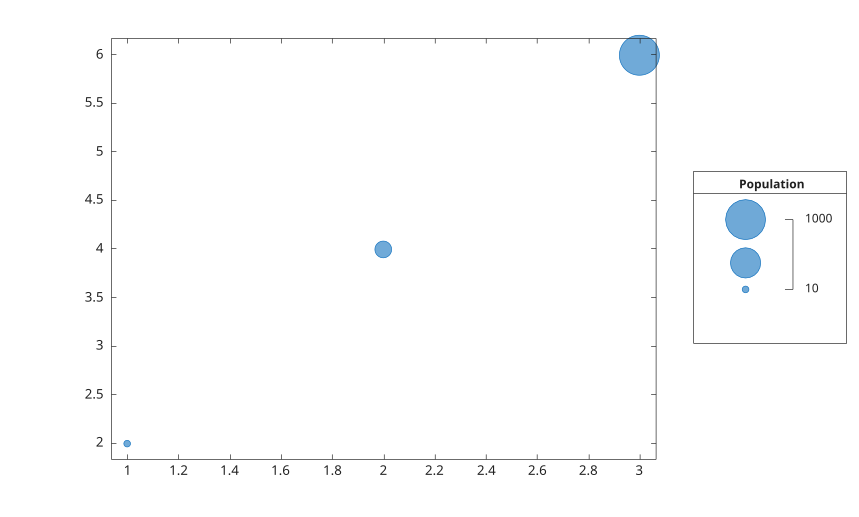

# bubblelegend

Ajoute une legende de taille de bulles.

## 📝 Syntaxe

- bubblelegend(title)
- bubblelegend(ax, title)
- bubblelegend(..., propertyName, propertyValue)
- bl = bubblelegend(...)

## 📥 Argument d'entrée

- title - Texte du titre de la legende.
- propertyName, propertyValue - Paires nom-valeur pour l'objet bubblelegend.

## 📤 Argument de sortie

- bl - Objet graphique de legende de bulles.

## 📄 Description


<b>bubblelegend</b> cree un objet graphique <b>bubblelegend</b>. 

Voir [proprietes de bubblelegend](../../../graphics/2_graphics_objects/4_properties/nelson.graphics.bubblelegend.properties.md) pour la liste complete des proprietes.

## 💡 Exemple

Ajouter une legende pour les tailles de bulles.

```matlab
figure();
bubblechart(1:3, [2 4 6], [10 100 1000]);
bubblesize([5 30]);
bubblelegend('Population', 'Location', 'eastoutside');
```



## 🔗 Voir aussi

[proprietes de bubblelegend](../../../graphics/2_graphics_objects/4_properties/nelson.graphics.bubblelegend.properties.md), [bubblechart](../../../graphics/1_plots/4_data_distribution_plots/bubblechart.md), [bubblesize](../../../graphics/1_plots/4_data_distribution_plots/bubblesize.md).
<!--
## 👤 Auteur

Allan CORNET
-->
