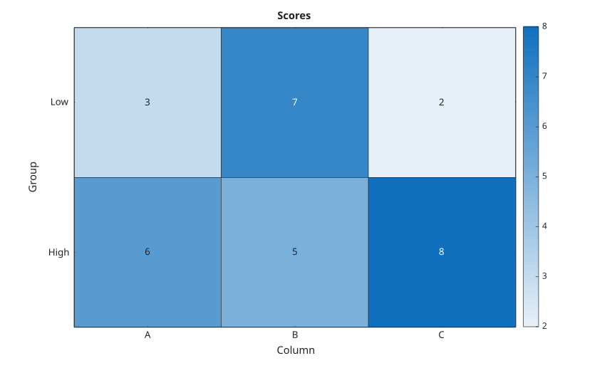
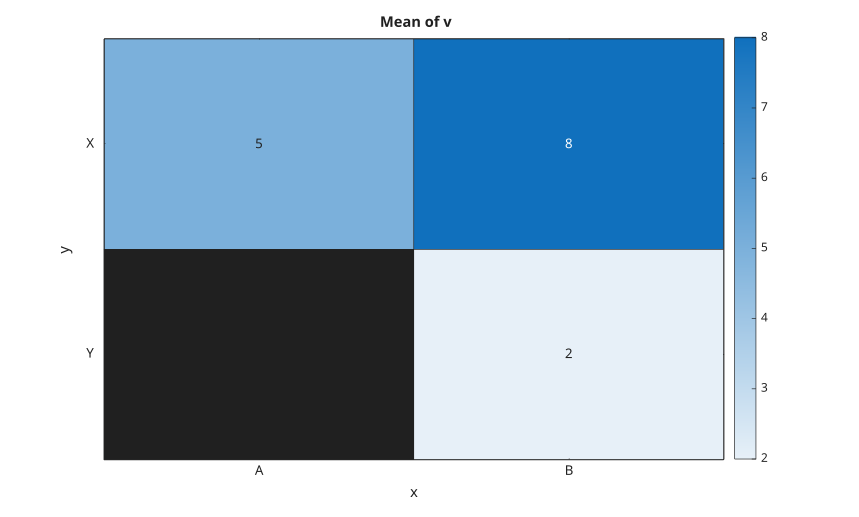
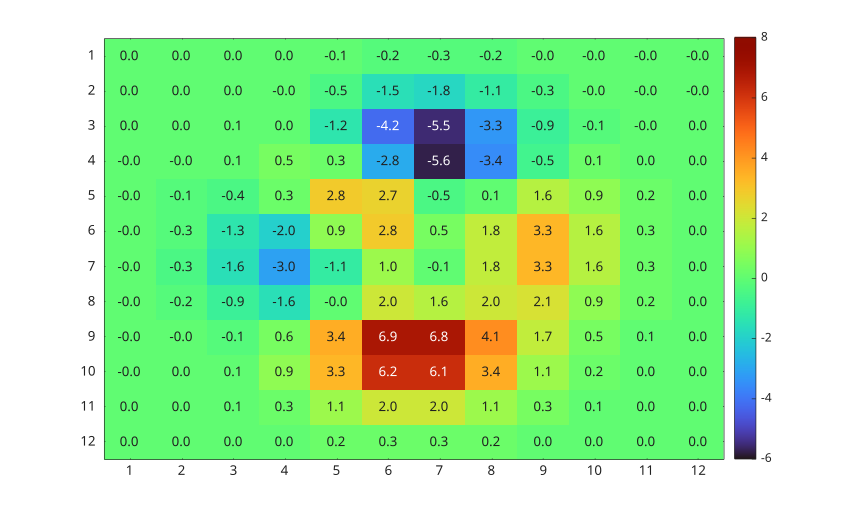

# heatmap

Creer une carte de chaleur depuis une matrice numerique ou une table.

## 📝 Syntaxe

- heatmap(C)
- heatmap(xvalues, yvalues, C)
- heatmap(tbl, xvar, yvar)
- heatmap(tbl, xvar, yvar, 'ColorVariable', cvar)
- heatmap(parent, ...)
- heatmap(..., propertyName, propertyValue)
- h = heatmap(...)

## 📥 Argument d'entrée

- C - Matrice numerique utilisee comme donnees de couleur.
- xvalues - Etiquettes des colonnes : cellule de chaines, string, caracteres ou vecteur numerique.
- yvalues - Etiquettes des lignes : cellule de chaines, string, caracteres ou vecteur numerique.
- tbl - Table source utilisee pour calculer les valeurs de couleur.
- xvar - Variable de table utilisee pour les categories x.
- yvar - Variable de table utilisee pour les categories y.
- cvar - Variable de table numerique moyennee pour chaque paire de categories x/y.
- parent - Axes ou hggroup parent.
- propertyName - Nom de propriete pris en charge.
- propertyValue - Valeur de propriete.

## 📤 Argument de sortie

- h - Objet graphique heatmap contenant l'image, la grille, les etiquettes et l'etat de la barre de couleurs.

## 📄 Description

<b>heatmap</b> affiche une matrice numerique sous forme d'image avec couleurs mises a l'echelle et etiquettes de lignes et colonnes. Pour une table, les categories sont triees et les donnees de couleur sont agregees par paire de categories.

Avec <b>heatmap(tbl, xvar, yvar)</b>, les donnees de couleur contiennent les comptages et <b>ColorMethod</b> vaut <b>count</b>. Avec <b>ColorVariable</b>, les donnees de couleur contiennent les moyennes et <b>ColorMethod</b> vaut <b>mean</b>.

Cette implementation retourne un objet graphique <b>heatmap</b>. Le champ <b>UserData</b> de l'objet contient <b>ChartType</b>, <b>Image</b>, <b>Grid</b>, <b>CellLabels</b>, <b>Colorbar</b>, <b>XData</b>, <b>YData</b>, <b>ColorData</b>, <b>SourceTable</b>, <b>XVariable</b>, <b>YVariable</b>, <b>ColorVariable</b>, <b>ColorMethod</b> et <b>Options</b>.

Les proprietes name/value prises en charge sont <b>Title</b>, <b>XLabel</b>, <b>YLabel</b>, <b>SourceTable</b>, <b>XVariable</b>, <b>YVariable</b>, <b>ColorVariable</b>, <b>ColorMethod</b>, <b>XData</b>, <b>YData</b>, <b>XDisplayLabels</b>, <b>YDisplayLabels</b>, <b>ColorLimits</b>, <b>Colormap</b>, <b>ColorbarVisible</b>, <b>GridVisible</b>, <b>CellLabelFormat</b>, <b>CellLabelColor</b>, <b>MissingDataLabel</b>, <b>FontColor</b>, <b>FontSize</b> et <b>Visible</b>.

## 💡 Exemples

Afficher une carte de chaleur numerique.

```matlab
C = [1 2 3; 4 5 6];
heatmap(C);
```


Utiliser des etiquettes de lignes et colonnes.

```matlab
C = [3 7 2; 6 5 8];
heatmap({'A', 'B', 'C'}, {'Low', 'High'}, C, ...
  'Title', 'Scores', 'XLabel', 'Column', 'YLabel', 'Group');
```


Creer une carte de chaleur depuis des categories de table.

```matlab
T = table({'B'; 'A'; 'B'}, {'Y'; 'X'; 'X'}, [2; 5; 8], ...
  'VariableNames', {'x', 'y', 'v'});
heatmap(T, 'x', 'y', 'ColorVariable', 'v');
```


Personnaliser les couleurs et les etiquettes.

```matlab
C = peaks(12);
heatmap(C, 'ColorLimits', [-6 8], 'Colormap', turbo(64), ...
  'CellLabelFormat', '%0.1f', 'GridVisible', 'off');
```



## 🔗 Voir aussi

[imagesc](../../../graphics/4_images/imagesc.md), [colorbar](../../../graphics/3_labels_styling/4_labels_annotations/colorbar.md), [colormap](../../../graphics/3_labels_styling/2_color_styling/colormaps/colormap.md).
