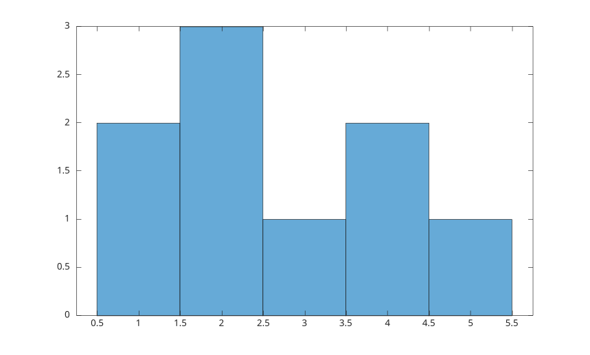
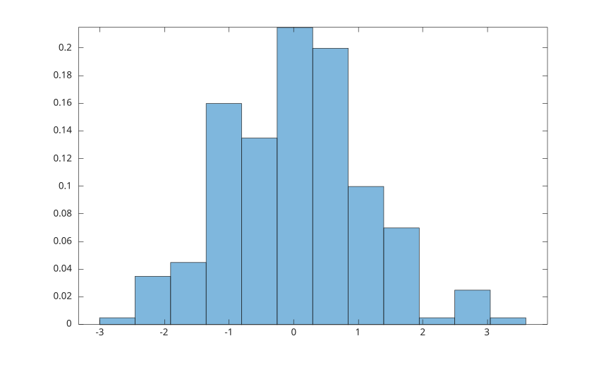

# histogram

Crée un histogramme.

## 📝 Syntaxe

- histogram(X)
- histogram(X, nbins)
- histogram(X, edges)
- histogram(C)
- histogram(C, categories)
- histogram(..., propertyName, propertyValue)
- histogram(ax, ...)
- h = histogram(...)

## 📥 Argument d'entrée

- X - données numériques.
- nbins - nombre de classes.
- edges - bornes de classes strictement croissantes.
- C - données catégorielles.
- categories - tableau de cellules de vecteurs de caractères ou tableau de chaînes sélectionnant les catégories à afficher et leur ordre.
- propertyName - nom d'une propriété de l'objet histogramme.
- propertyValue - valeur d'une propriété de l'objet histogramme.
- ax - objet axes cible.

## 📤 Argument de sortie

- h - objet graphique histogramme.

## 📄 Description

<b>histogram</b> regroupe des données numériques en classes et affiche les valeurs sous forme de barres ou d'escaliers.

Lorsque <b>C</b> est un tableau catégoriel, <b>histogram</b> trace une barre par catégorie, dont la hauteur est le nombre d'éléments de cette catégorie. Les barres sont affichées dans l'ordre des catégories (celui renvoyé par <b>categories</b>) et les noms des catégories servent d'étiquettes de graduation. Un second argument peut indiquer les catégories à afficher et leur ordre.

Voir [proprietes de histogram](../../../graphics/2_graphics_objects/4_properties/nelson.graphics.histogram.properties.md) pour la liste complete des proprietes.

## 💡 Exemples

```matlab
x = [1 1 2 2 2 3 4 4 5];
histogram(x);

```



```matlab
x = randn(200, 1);
histogram(x, 12, 'Normalization', 'probability', 'FaceAlpha', 0.5);

```



```matlab
x = [1 1 2 3 3 4 5];
h = histogram(x, [0 2 4 6], 'DisplayStyle', 'stairs');
h.LineWidth = 1.5;

```


Histogramme catégoriel : une barre par catégorie, effectifs dans l'ordre des catégories.

```matlab
C = categorical({'small', 'medium', 'large', 'small', 'medium', 'small'});
histogram(C);

```


## 🔗 Voir aussi

[proprietes de histogram](../../../graphics/2_graphics_objects/4_properties/nelson.graphics.histogram.properties.md), [hist](../../../graphics/1_plots/4_data_distribution_plots/hist.md), [bar](../../../graphics/1_plots/6_discrete_data_plots/bar.md).

<!--
## 👤 Auteur

Allan CORNET
-->
