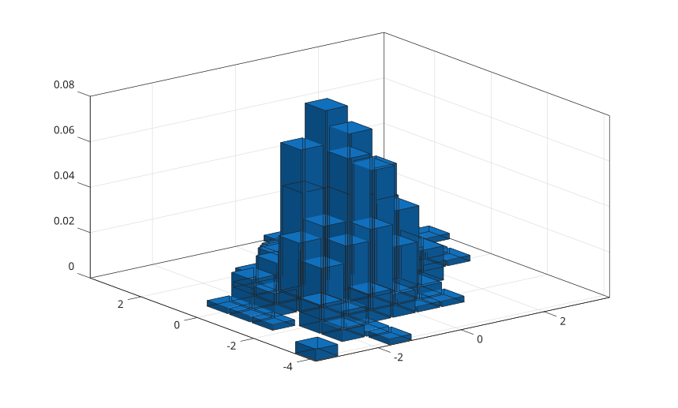
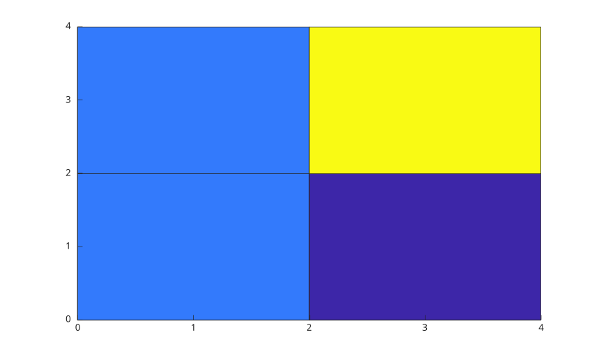

# histogram2

Cree un histogramme bivarie.

## 📝 Syntaxe

- histogram2(X, Y)
- histogram2(X, Y, nbins)
- histogram2(X, Y, xedges, yedges)
- histogram2(..., propertyName, propertyValue)
- histogram2(ax, ...)
- h = histogram2(...)

## 📥 Argument d'entrée

- X - valeurs x.
- Y - valeurs y avec le meme nombre d'elements que X.
- nbins - nombre de classes, scalaire ou vecteur a deux elements.
- xedges - bornes x strictement croissantes.
- yedges - bornes y strictement croissantes.
- propertyName - nom d'une propriete de l'objet histogram2.
- propertyValue - valeur d'une propriete de l'objet histogram2.
- ax - objet axes cible.

## 📤 Argument de sortie

- h - objet graphique histogram2.

## 📄 Description

<b>histogram2</b> regroupe des donnees numeriques appariees en classes et affiche les valeurs sous forme de barres 3-D ou de tuiles.

Voir [proprietes de histogram2](../../../graphics/2_graphics_objects/4_properties/nelson.graphics.histogram2.properties.md) pour la liste complete des proprietes.

## 💡 Exemples

```matlab
x = [1 1 2 3 4 4];
y = [1 2 2 3 3 4];
histogram2(x, y, [0 2 4], [0 2 4]);

```


```matlab
x = randn(400, 1);
y = 0.5 * x + randn(400, 1);
histogram2(x, y, [12 10], 'Normalization', 'probability');

```



```matlab
x = [1 1 2 3 4 4];
y = [1 2 2 3 3 4];
h = histogram2(x, y, [0 2 4], [0 2 4], 'DisplayStyle', 'tile');
h.ShowEmptyBins = 'on';

```



## 🔗 Voir aussi

[proprietes de histogram2](../../../graphics/2_graphics_objects/4_properties/nelson.graphics.histogram2.properties.md), [histogram](../../../graphics/1_plots/4_data_distribution_plots/histogram.md), [surf](../../../graphics/1_plots/7_surfaces_volumes_polygons/surf.md).

<!--
## 👤 Auteur

Allan CORNET
-->
