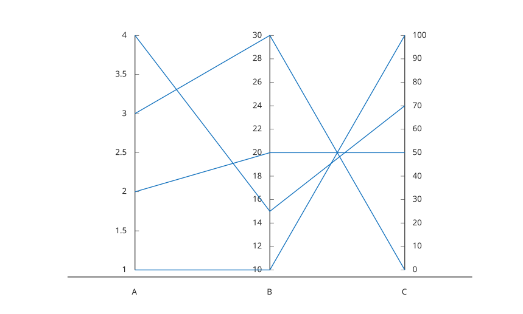

# parallelplot

Affiche un graphique en coordonnees paralleles.

## 📝 Syntaxe

- parallelplot(X)
- parallelplot(T)
- parallelplot(T, 'CoordinateVariables', variables)
- parallelplot(..., 'GroupData', groupe)
- parallelplot(..., 'GroupVariable', variableGroupe)
- parallelplot(..., 'CoordinateTickLabels', etiquettes)
- h = parallelplot(...)

## 📄 Description

<b>parallelplot</b> affiche les lignes d'une matrice numerique ou les variables numeriques d'une table sous forme de coordonnees paralleles.

L'objet retourne a le type <b>parallelplot</b>. Voir [proprietes de parallelplot](../../../graphics/2_graphics_objects/4_properties/nelson.graphics.parallelplot.properties.md) pour la liste complete des proprietes.

## 💡 Exemples

Tracer les lignes d'une matrice en coordonnees paralleles.

```matlab
X = [1 10 100; 2 20 50; 3 30 0; 4 15 70];
parallelplot(X, 'CoordinateTickLabels', {'A', 'B', 'C'});
```


Tracer des variables selectionnees dans une table et grouper les lignes par variable de table.

```matlab
T = table([1; 2; 3], [4; 5; 6], {'a'; 'a'; 'b'}, 'VariableNames', {'A', 'B', 'G'});
parallelplot(T, 'CoordinateVariables', {'A', 'B'}, 'GroupVariable', 'G');
```


## 🔗 Voir aussi

[plotmatrix](../../../graphics/1_plots/4_data_distribution_plots/plotmatrix.md), [stackedplot](../../../graphics/1_plots/4_data_distribution_plots/stackedplot.md), [proprietes de parallelplot](../../../graphics/2_graphics_objects/4_properties/nelson.graphics.parallelplot.properties.md), [table](../../../table/table.md).
