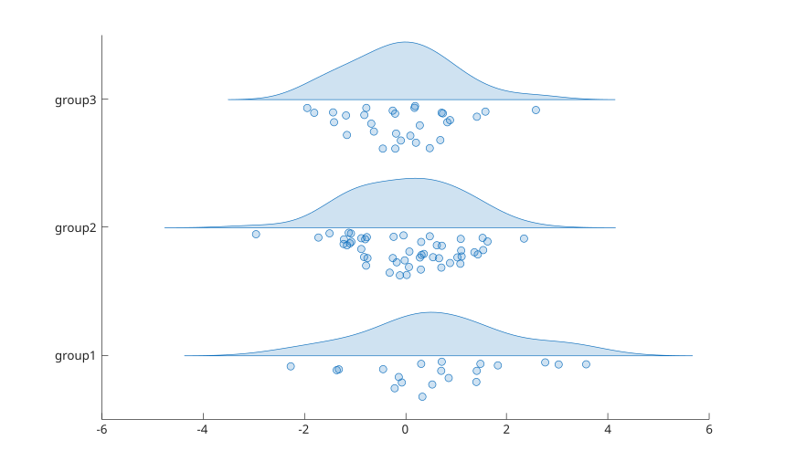

# raincloudplot

Visualiser des donnees numeriques groupees avec des graphiques en nuage de pluie.

## 📝 Syntaxe

- raincloudplot(ydata)
- raincloudplot(xgroupdata, ydata)
- raincloudplot(tbl, yvar)
- raincloudplot(tbl, xvar, yvar)
- raincloudplot(..., propertyName, propertyValue)
- raincloudplot(ax, ...)
- r = raincloudplot(...)

## 📥 Argument d'entrée

- ydata - donnees de l'echantillon: vecteur ou matrice numerique. Une matrice cree un nuage de pluie par colonne.
- xgroupdata - donnees de groupement positionnel: vecteur numerique ou categorical ayant le meme nombre d'elements que ydata, ou matrice de meme taille que ydata. Un nuage de pluie est dessine pour chaque valeur unique.
- tbl - table ou timetable contenant les donnees.
- yvar - variables de table contenant l'echantillon numerique: noms, indices numeriques ou selecteur logique.
- xvar - variables de table contenant les donnees de groupement numeriques ou categorical.
- ax - axes cibles (par defaut: axes courants).
- DensityWidth - scalaire positif: largeur maximale d'un nuage de pluie en unites des donnees de groupement (par defaut: 0.9).
- Orientation - 'horizontal' (par defaut) ou 'vertical'. Avec 'horizontal', les valeurs de l'echantillon sont le long de l'axe x et les groupes le long de l'axe y.

## 📤 Argument de sortie

- r - objet graphique raincloudplot, ou vecteur colonne d'objets: un par colonne d'une matrice, ou un par variable de table dans xvar ou yvar (celle qui en contient le plus).

## 📄 Description

<b>raincloudplot</b> visualise la distribution empirique d'un echantillon ainsi que les valeurs elles-memes. Une moitie du graphique est un demi-violon (le nuage) qui montre une estimation par noyau de la densite; l'autre moitie est un essaim de marqueurs (la pluie), un marqueur par valeur, eloignes de la ligne de base du nuage pour eviter qu'ils se superposent.

Avec l'orientation horizontale par defaut, le nuage est dessine au-dessus de la position du groupe et la pluie en dessous. Avec l'orientation verticale, le nuage est dessine a droite de la position du groupe et la pluie a gauche.

L'estimation de densite par noyau est celle utilisee par <b>violinplot</b>. Les largeurs des nuages de tous les groupes d'un objet sont mises a l'echelle ensemble de sorte que le nuage le plus large atteigne la moitie de <b>DensityWidth</b>. L'etalement de la pluie suit la densite locale.

Chaque objet a sa propre couleur: <b>FaceColor</b> est pris dans <b>ColorOrder</b> des axes selon <b>SeriesIndex</b>, qui suit l'ordre de creation dans les axes. <b>EdgeColor</b>, <b>MarkerFaceColor</b> et <b>MarkerEdgeColor</b> suivent <b>FaceColor</b> tant que leur mode vaut 'auto'.

Les donnees de groupement categorical sont placees a des positions entieres consecutives etiquetees par le nom des categories. Quand plusieurs variables de table servent de donnees de groupement, les categories de meme nom partagent la meme position.

La page [proprietes raincloudplot](../../../graphics/2_graphics_objects/4_properties/nelson.graphics.raincloudplot.properties.md) liste les proprietes d'objet prises en charge.

## 💡 Exemples

Nuages de pluie de donnees groupees.

```matlab
ydata = randn(100, 1);
xgroupdata = categorical(repelem(["group1"; "group2"; "group3"], [20, 50, 30]));
raincloudplot(xgroupdata, ydata)
```


Nuages de pluie superposes avec des couleurs choisies.

```matlab
figure
hold on
r1 = raincloudplot(80 + 8 * randn(40, 1));
r2 = raincloudplot(75 + 6 * randn(60, 1));
r1.FaceColor = "g";
r2.FaceColor = "m";
legend("Smoker", "Nonsmoker")
```

Nuages de pluie a partir de variables de table.

```matlab
X1 = categorical(repelem(["group1"; "group2"], [90, 10]));
X3 = categorical(repelem(["group3"; "group4"], [25, 75]));
tbl = table(X1, X3, randn(100, 1), randn(100, 1) + 5, 'VariableNames', {'X1', 'X3', 'Y1', 'Y2'});
figure
raincloudplot(tbl, ["X1", "X3"], ["Y1", "Y2"])
```

## 🔗 Voir aussi

[violinplot](../../../graphics/1_plots/4_data_distribution_plots/violinplot.md), [swarmchart](../../../graphics/1_plots/4_data_distribution_plots/swarmchart.md), [boxchart](../../../graphics/1_plots/4_data_distribution_plots/boxchart.md), [proprietes raincloudplot](../../../graphics/2_graphics_objects/4_properties/nelson.graphics.raincloudplot.properties.md).

## 🕔 Historique

| Version | 📄 Description   |
| ------- | ---------------- |
| 2.0.0   | version initiale |

<!--
## 👤 Auteur

Allan CORNET
-->
