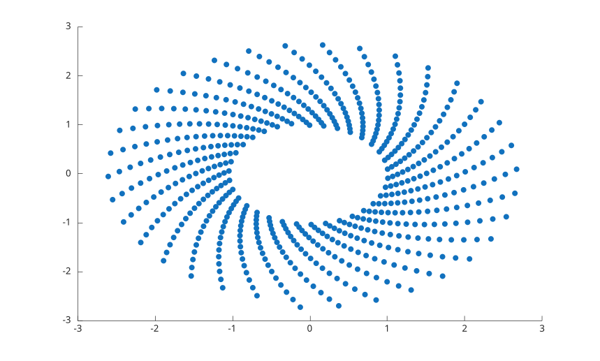
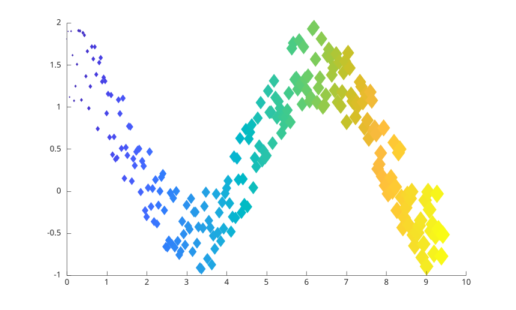
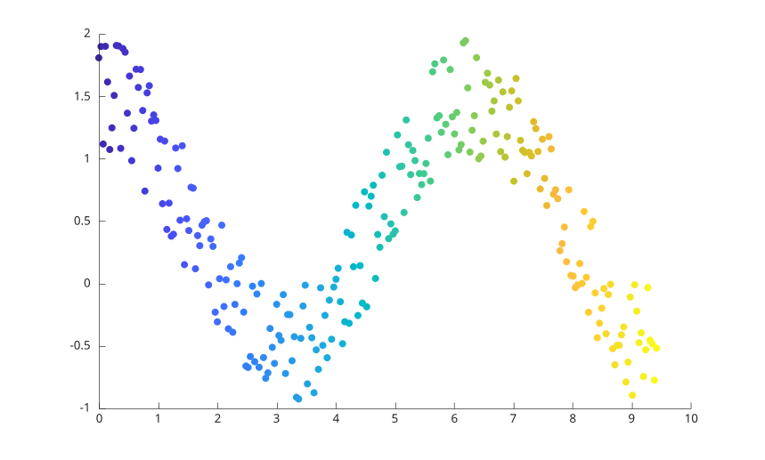
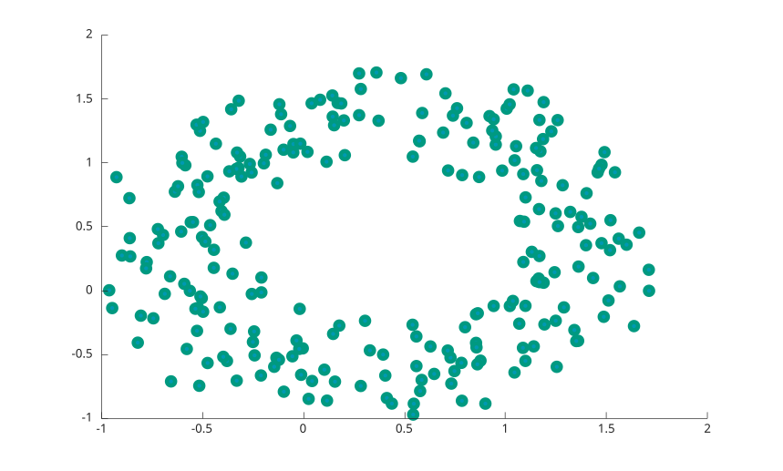
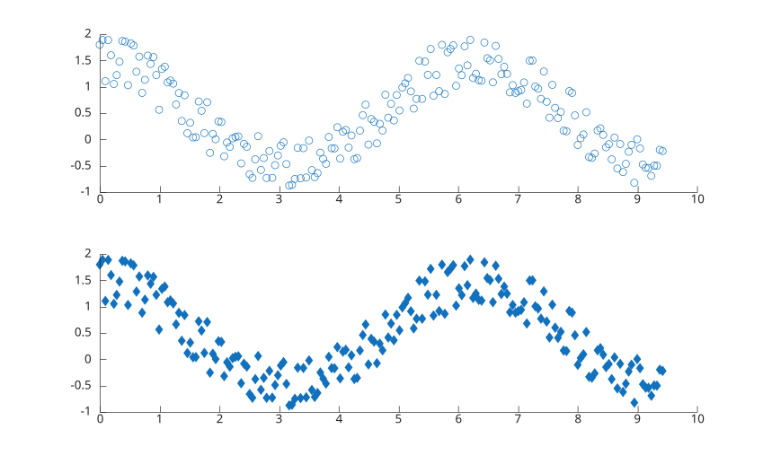
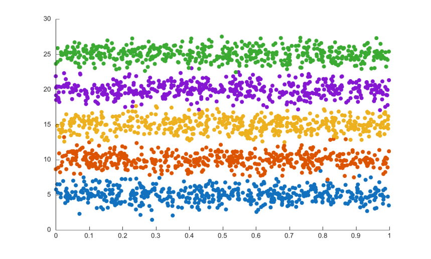
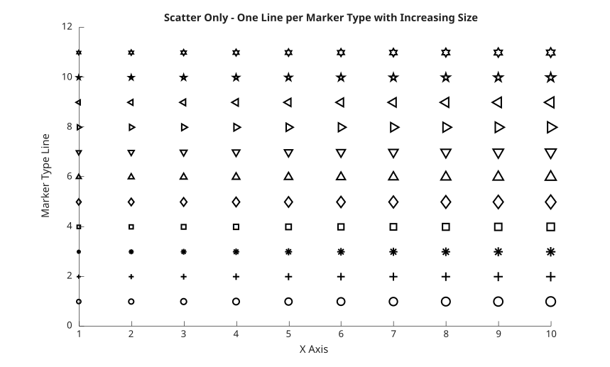

# scatter

Nuage de points.

## 📝 Syntaxe

- scatter(x, y)
- scatter(x, y, sz)
- scatter(x, y, sz, c)
- scatter(..., 'filled')
- scatter(..., marker)
- scatter(ax, ...)
- scatter(..., propertyName, propertyValue)
- s = scatter(...)

## 📥 Argument d'entrée

- X - Coordonnées x : vecteur ou matrice.
- Y - Coordonnées y : vecteur ou matrice.
- sz - Taille du marqueur : scalaire numérique, vecteur, [] (par défaut : 36)
- c - Couleur du marqueur : nom court de couleur, nom de couleur, triplet RGB ou vecteur d'indices de la carte de couleurs
- ax - Un objet graphique scalaire : conteneur parent, spécifié comme axes.
- propertyName - Une chaine scalaire ou un vecteur ligne de caracteres. Voir [proprietes de scatter](../../../graphics/2_graphics_objects/4_properties/nelson.graphics.scatter.properties.md) pour la liste des proprietes.
- propertyValue - Une valeur.

## 📤 Argument de sortie

- s - Un objet graphique : type scatter ou tableau de scatter.

## 📄 Description

<b>scatter(x, y)</b> génère un nuage de points en plaçant des marqueurs circulaires aux coordonnées définies par les vecteurs <b>x</b> et<b>y</b>.

Si vous souhaitez afficher un seul ensemble de données, assurez-vous que <b>x</b> et <b>y</b> sont des vecteurs de même longueur.

Pour visualiser plusieurs ensembles de données sur un même axe, vous pouvez utiliser une matrice pour <b>x</b> ou<b>y</b>, en gardant l'autre comme vecteur.

Cela vous permet de superposer ou de comparer plusieurs ensembles de données dans le même graphique.

Voir [proprietes de scatter](../../../graphics/2_graphics_objects/4_properties/nelson.graphics.scatter.properties.md) pour la liste complete des proprietes.

## 💡 Exemples

```matlab

f = figure();
theta = linspace(0,1,600);
x = exp(theta).*sin(110*theta);
y = exp(theta).*cos(110*theta);
s = scatter(x,y ,'filled');
```



```matlab

f = figure();
x = linspace(0,3*pi,255);
y = cos(x) + rand(1,255);
sz = 1:255;
c = 1:length(x);
scatter(x, y, sz, c, 'd', 'filled')

```



```matlab

f = figure();
x = linspace(0, 3*pi, 255);
y = cos(x) + rand(1, 255);
c = linspace(1,10,length(x));
scatter(x, y, [], c, 'filled')

```



```matlab

f = figure();
theta = linspace(0,2*pi,244);
x = sin(theta) + 0.75*rand(1,244);
y = cos(theta) + 0.75*rand(1,244);
sz = 45;
scatter(x,y,sz,'MarkerEdgeColor',[0 .6 .5], 'MarkerFaceColor',[0 .6 .7],  'LineWidth',3.5)

```



```matlab

f = figure(),
x = linspace(0,3*pi,200);
y = cos(x) + rand(1,200);
% Top plot
ax1 = subplot(2,1, 1);
scatter(ax1,x,y)
% Bottom plot
ax2 = subplot(2,1, 2);
scatter(ax2,x,y,'filled','d')

```



```matlab

f = figure();
x = rand(500,5);
y = randn(500,5) + (5:5:25);
s = scatter(x,y, 'filled');

```



```matlab

f = figure();
% Create figure
hold on;
% Settings
nPoints = 10; % Number of points per marker type
markers = {'o', '+', '*', 's', 'd', '^', 'v', '>', '<', 'p', 'h'};
sizesMin = 20; % Minimum size
sizesMax = 100; % Maximum size
% X positions
x = linspace(1, 10, nPoints);
% Fixed color
fixedColor = [0 0 0]; % black
% Plot each marker type
for m = 1:numel(markers)
    y = m * ones(size(x)); % Constant Y for each marker type
    sizes = linspace(sizesMin, sizesMax, nPoints); % Increasing sizes
    % Scatter points
    scatter(x, y, sizes, ...
        'Marker', markers{m}, ...
        'MarkerEdgeColor', fixedColor, ...
        'MarkerFaceColor', 'none', ...
        'LineWidth', 1.5);
end
title('Scatter Only - One Line per Marker Type with Increasing Size');
xlabel('X Axis');
ylabel('Marker Type Line');
ylim([0 numel(markers)+1]);
hold off;

```



## 🔗 Voir aussi

[proprietes de scatter](../../../graphics/2_graphics_objects/4_properties/nelson.graphics.scatter.properties.md), [line](../../../graphics/1_plots/1_line_plots/line.md), [plot](../../../graphics/1_plots/1_line_plots/plot.md), [scatter3](../../../graphics/1_plots/4_data_distribution_plots/scatter3.md).

## 🕔 Historique

| Version | 📄 Description                                             |
| ------- | ---------------------------------------------------------- |
| 1.0.0   | version initiale                                           |
| 1.12.0  | Gestion des noms de couleur et des noms courts de couleur. |
| 1.14.0  | Scatter est un objet graphique avec des proprietes.        |

<!--
## 👤 Auteur

Allan CORNET
-->
