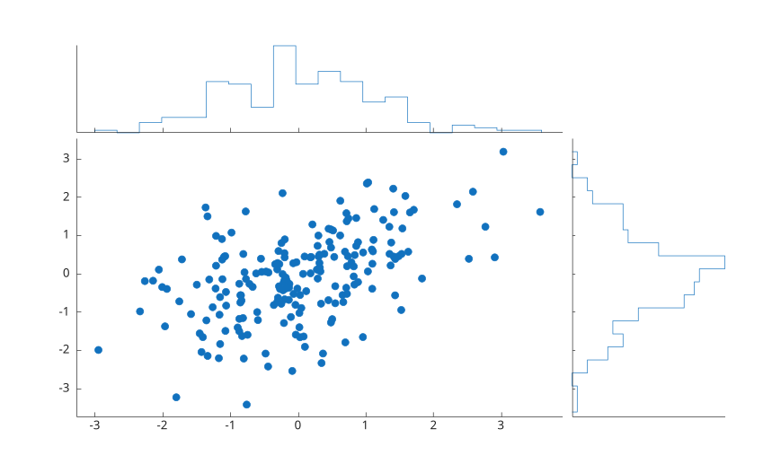

# scatterhistogram

Affiche un nuage de points avec histogrammes marginaux.

## 📝 Syntaxe

- scatterhistogram(x, y)
- scatterhistogram(..., 'NumBins', n)
- scatterhistogram(..., 'MarkerStyle', marqueur)
- h = scatterhistogram(...)

## 📄 Description


<b>scatterhistogram</b> cree un nuage de points et affiche les histogrammes des distributions x et y. 

L'objet retourne a le type <b>scatterhistogram</b>. Voir [proprietes de scatterhistogram](../../../graphics/2_graphics_objects/4_properties/nelson.graphics.scatterhistogram.properties.md) pour la liste complete des proprietes.

## 💡 Exemple

Creer un nuage avec histogrammes marginaux.

```matlab
x = randn(200, 1);
y = 0.5 * x + randn(200, 1);
scatterhistogram(x, y, 'NumBins', 20);
```



## 🔗 Voir aussi

[scatter](../../../graphics/1_plots/4_data_distribution_plots/scatter.md), [histogram](../../../graphics/1_plots/4_data_distribution_plots/histogram.md), [binscatter](../../../graphics/1_plots/4_data_distribution_plots/binscatter.md), [proprietes de scatterhistogram](../../../graphics/2_graphics_objects/4_properties/nelson.graphics.scatterhistogram.properties.md).