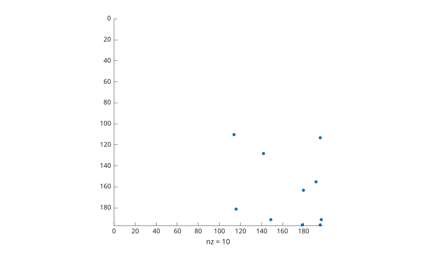
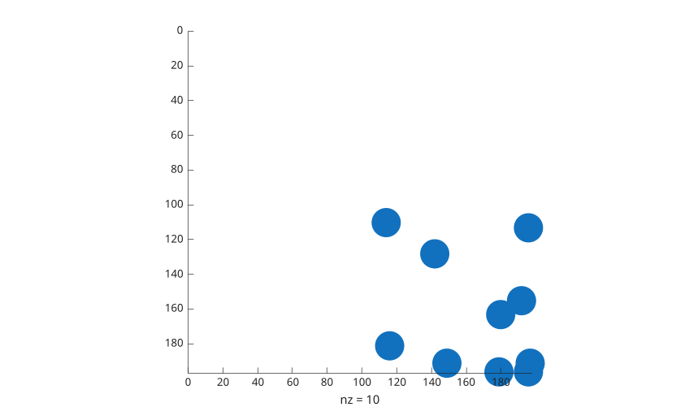
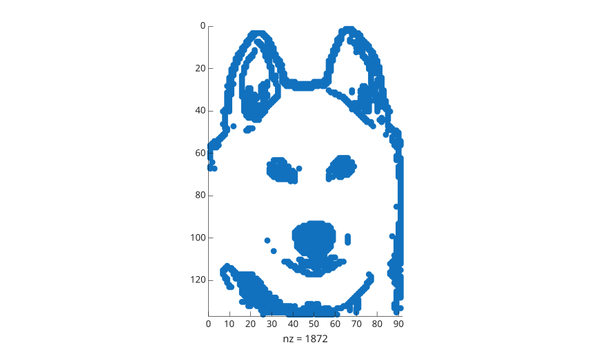

# spy

Visualiser le motif de parcimonie d'une matrice.

## 📝 Syntaxe

- spy(S)
- spy(S, LineSpec)
- spy(S, LineSpec, MarkerSize)

## 📥 Argument d'entrée

- S - matrice : creuse ou dense.
- LineSpec - Style de ligne, marqueur et/ou couleur : vecteur de caractères ou chaîne scalaire.
- MarkerSize - Valeur entière scalaire positive.

## 📄 Description

<b>spy(S)</b> trace le motif de parcimonie de la matrice creuse <b>S</b>.

## 💡 Exemples

```matlab
f = figure();
rng('default');
S = sparse(round((rand(1, 10) + 1) * 100), round((rand(1, 10) + 1) * 100) , (rand(1, 10) + 1) * 10);
spy(S);
```



```matlab
f = figure();
rng('default');
S = sparse(round((rand(1, 10) + 1) * 100), round((rand(1, 10) + 1) * 100) , (rand(1, 10) + 1) * 100);
spy(S, 45);
```



```matlab
f = figure();
spy();
```



## 🔗 Voir aussi

[sparse](../../../sparse/sparse.md), [plot](../../../graphics/1_plots/1_line_plots/plot.md).

## 🕔 Historique

| Version | 📄 Description   |
| ------- | ---------------- |
| 1.0.0   | version initiale |

<!--
## 👤 Auteur

Allan CORNET
-->
