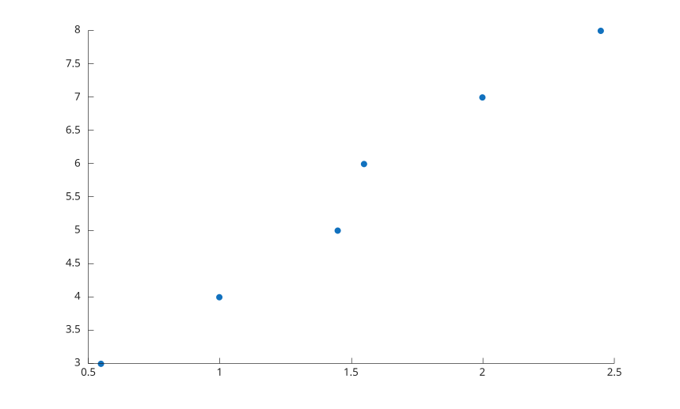

# swarmchart

Afficher un swarm chart 2-D.

## 📝 Syntaxe

- swarmchart(x, y)
- swarmchart(x, y, sz, c)
- swarmchart(..., propertyName, propertyValue)
- h = swarmchart(...)

## 📄 Description


<b>swarmchart</b> affiche les points avec un objet scatter. L'objet retourne conserve les donnees <b>XData</b> et <b>YData</b> originales et utilise les proprietes de jitter de scatter pour les positions x affichees. 

Les proprietes prises en charge sont <b>XJitter</b>, <b>XJitterWidth</b> et <b>ColorVariable</b>. Les autres arguments sont transmis a <b>scatter</b>.

## 💡 Exemple

Afficher des observations groupees.

```matlab
swarmchart([1 1 1 2 2 2], [4 5 3 7 6 8], 'filled');
```



## 🔗 Voir aussi

[scatter](../../../graphics/1_plots/4_data_distribution_plots/scatter.md), [swarmchart3](../../../graphics/1_plots/4_data_distribution_plots/swarmchart3.md).