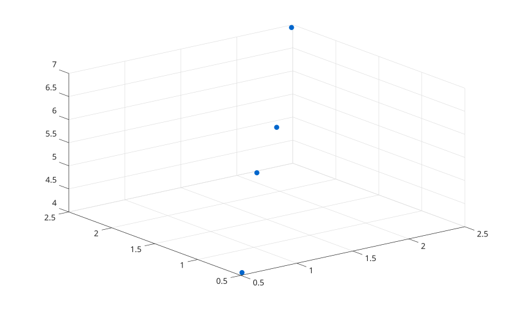

# swarmchart3

Afficher un swarm chart 3-D.

## 📝 Syntaxe

- swarmchart3(x, y, z)
- swarmchart3(x, y, z, sz, c)
- swarmchart3(..., propertyName, propertyValue)
- h = swarmchart3(...)

## 📄 Description


<b>swarmchart3</b> affiche des points 3-D avec un objet scatter. L'objet retourne conserve les donnees <b>XData</b>, <b>YData</b> et <b>ZData</b> originales et utilise les proprietes de jitter de scatter pour les positions x et y affichees. 

Les proprietes prises en charge sont <b>XJitter</b>, <b>XJitterWidth</b>, <b>YJitter</b>, <b>YJitterWidth</b> et <b>ColorVariable</b>.

## 💡 Exemple

Afficher des observations groupees 3-D.

```matlab
swarmchart3([1 1 2 2], [1 2 1 2], [4 5 6 7], 40, [0 0.4 0.8], 'filled');
```



## 🔗 Voir aussi

[scatter3](../../../graphics/1_plots/4_data_distribution_plots/scatter3.md), [swarmchart](../../../graphics/1_plots/4_data_distribution_plots/swarmchart.md).