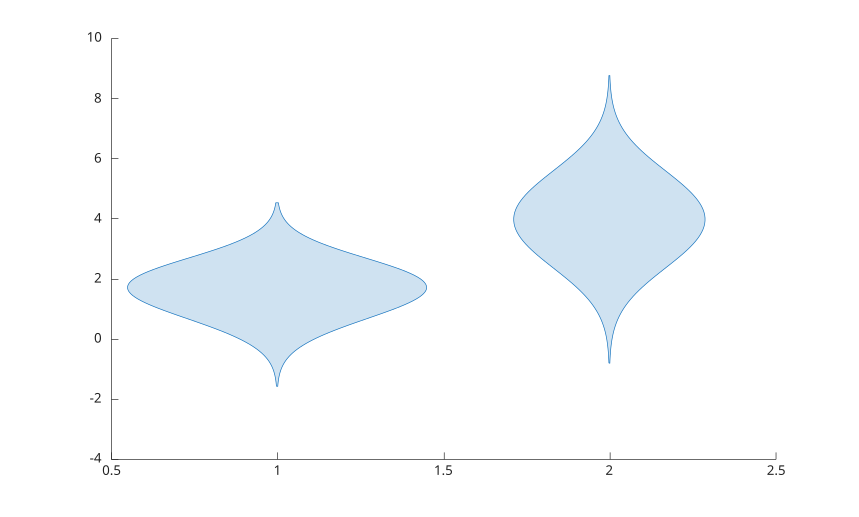

# violinplot

Afficher des distributions sous forme de violons.

## 📝 Syntaxe

- violinplot(y)
- violinplot(xgroupdata, y)
- violinplot('EvaluationPoints', evalPoints, 'DensityValues', densityValues)
- violinplot(..., propertyName, propertyValue)
- h = violinplot(...)

## 📄 Description

<b>violinplot</b> affiche des distributions sous forme de violons et retourne un ou plusieurs objets graphiques <b>violinplot</b>.

Pour des donnees vectorielles, l'objet retourne conserve <b>XData</b> comme positions de groupe et <b>YData</b> comme valeurs originales. Pour une matrice, un objet est retourne par colonne.

Avec <b>EvaluationPoints</b> et <b>DensityValues</b> sans donnees, <b>violinplot</b> trace des densites precalculees: un violon par colonne, aux positions 1, 2, ... Les deux arguments sont alors requis, et ils ne peuvent pas etre combines avec des donnees.

Chaque violon trace une estimation de densite par noyau gaussien de ses valeurs, evaluee sur 100 points de min(y) - 3h a max(y) + 3h. La largeur de bande suit la regle de reference normale avec une echelle robuste : h = (MAD / 0.6745) \* (4 / (3 n))^(1/5), ou MAD est l'ecart absolu median. Si la MAD est nulle, l'etendue des donnees sert d'echelle, et des donnees constantes utilisent h = 1.

La page [proprietes violinplot](../../../graphics/2_graphics_objects/4_properties/nelson.graphics.violinplot.properties.md) liste les proprietes d'objet prises en charge.

## 💡 Exemple

Afficher des distributions groupees.

```matlab
violinplot([1 1 1 2 2 2], [1 2 2 3 4 5]);
```



## 🔗 Voir aussi

[boxchart](../../../graphics/1_plots/4_data_distribution_plots/boxchart.md), [proprietes violinplot](../../../graphics/2_graphics_objects/4_properties/nelson.graphics.violinplot.properties.md).
