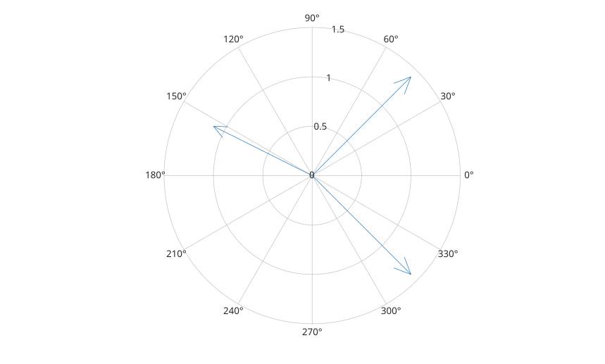

# compassplot

Affiche des vecteurs depuis l'origine en coordonnees polaires.

## 📝 Syntaxe

- compassplot(z)
- compassplot(theta, r)
- compassplot(parent, ...)
- h = compassplot(...)

## 📄 Description


<b>compassplot</b> affiche des valeurs complexes ou des paires de coordonnees polaires sous forme de fleches partant de l'origine. Le handle retourne est un objet <b>compassplot</b>. 

La page [proprietes de compassplot](../../../graphics/2_graphics_objects/4_properties/nelson.graphics.compassplot.properties.md) liste les proprietes d'objet prises en charge.

## 💡 Exemple

Afficher des vecteurs complexes.

```matlab
z = [1 + 1i, 1 - 1i, -1 + 0.5i];
compassplot(z);
```



## 🔗 Voir aussi

[polarplot](../../../graphics/1_plots/2_polar_plots/polarplot.md), [proprietes de compassplot](../../../graphics/2_graphics_objects/4_properties/nelson.graphics.compassplot.properties.md), [quiver](../../../graphics/1_plots/5_vector_fields/quiver.md).