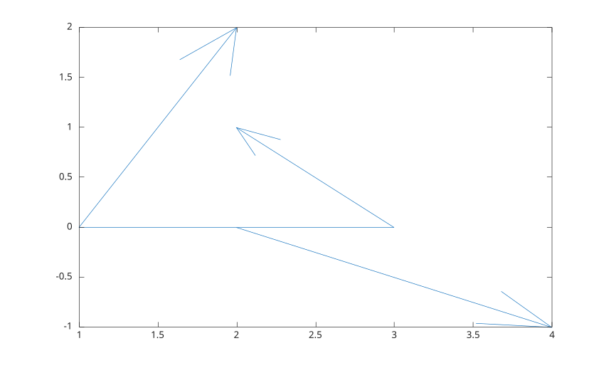
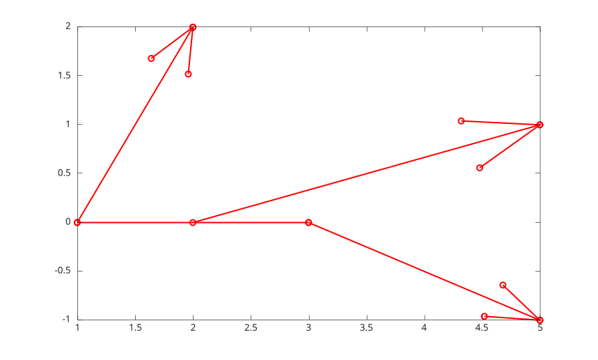

# feather

Afficher des vecteurs depuis une ligne de base.

## 📝 Syntaxe

- feather(Z)
- feather(U, V)
- feather(..., LineSpec)
- feather(..., nomPropriete, valeurPropriete)
- feather(parent, ...)
- h = feather(...)

## 📄 Description

<b>feather</b> affiche des vecteurs 2-D depuis y = 0. Une entree complexe utilise la partie reelle comme composante horizontale et la partie imaginaire comme composante verticale.

La sortie est un vecteur colonne d'objets graphiques <b>line</b>: une ligne par fleche et une ligne pour la base.

## 💡 Exemples

Afficher des vecteurs depuis des valeurs complexes.

```matlab
z = [1 + 2i, 2 - 1i, -1 + 1i];
feather(z);
```


Utiliser un style de ligne et des proprietes de ligne.

```matlab
u = [1 3 2];
v = [2 1 -1];
h = feather(u, v, '-or', 'LineWidth', 1.5);
```



## 🔗 Voir aussi

[proprietes de line](../../../graphics/2_graphics_objects/4_properties/nelson.graphics.line.properties.md), [quiver](../../../graphics/1_plots/5_vector_fields/quiver.md), [compassplot](../../../graphics/1_plots/5_vector_fields/compassplot.md).
