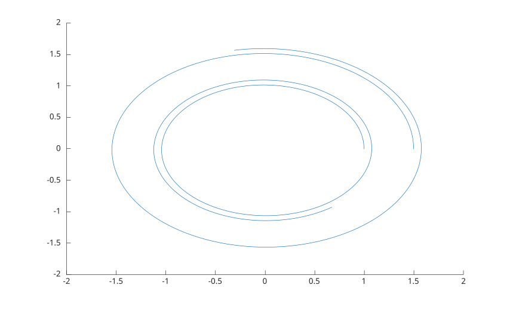

# stream2

Calculer les sommets de lignes de courant 2-D depuis un champ vectoriel.

## 📝 Syntaxe

- vertices = stream2(U, V, startx, starty)
- vertices = stream2(X, Y, U, V, startx, starty)
- vertices = stream2(..., options)

## 📄 Description

<b>stream2</b> suit un champ vectoriel 2-D depuis chaque point de depart et rend les sommets par lesquels il est passe. Rien n'est trace : passer le resultat a <b>streamline</b> pour le voir.

Le resultat est un tableau de cellules avec une entree par point de depart, chacune un tableau N-by-2 de coordonnees <b>[x, y]</b> dont la premiere ligne est le point de depart lui-meme. Un point de depart hors du champ donne une entree vide ; un point de depart que le champ ne deplace pas garde son unique sommet.

Sans <b>X</b> ni <b>Y</b> le champ est indexe a partir de 1, comme le donnerait <b>meshgrid(1:size(U, 2), 1:size(U, 1))</b>.

L'entree optionnelle <b>options</b> vaut <b>[stepsize]</b> ou <b>[stepsize, maxvert]</b>. <b>stepsize</b> se compte en cellules de grille et vaut 0.1 par defaut. <b>maxvert</b> est le nombre maximal de sommets a produire, point de depart compris, et vaut 500 par defaut.

## 💡 Exemple

Tracer deux lignes de courant d'un champ tournant.

```matlab
[x, y] = meshgrid(-2:0.25:2, -2:0.25:2);
vertices = stream2(x, y, -y, x, [1 1.5], [0 0]);
streamline(vertices);
```



## 🔗 Voir aussi

[stream3](../../../graphics/1_plots/5_vector_fields/stream3.md), [streamline](../../../graphics/1_plots/5_vector_fields/streamline.md), [quiver](../../../graphics/1_plots/5_vector_fields/quiver.md).
