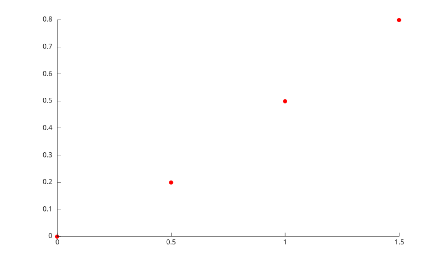

# streamparticles

Afficher des marqueurs de particules le long de chemins de courant.

## 📝 Syntaxe

- streamparticles(vertices)
- streamparticles(vertices, n)
- streamparticles(parent, vertices, n)
- streamparticles(lineHandle, vertices, n)
- streamparticles(..., name, value)
- h = streamparticles(...)

## 📥 Argument d'entrée

- vertices - Tableau de cellules d'ensembles de coordonnees de lignes de courant, avec deux ou trois colonnes.
- lineHandle - Objet line existant a reutiliser pour les marqueurs de particules.
- n - Nombre de marqueurs de particules a echantillonner sur chaque ligne de courant.
- name, value - Les proprietes prises en charge incluent Marker, MarkerEdgeColor, MarkerFaceColor, Animate, FrameRate et ParticleAlignment.

## 📄 Description

<b>streamparticles</b> affiche des marqueurs aux positions echantillonnees depuis des sommets de lignes de courant pre-calcules.

## 💡 Exemples

Afficher des particules de courant.

```matlab
vertices = {[0 0; 0.5 0.2; 1 0.5; 1.5 0.8]};
streamparticles(vertices);
```


Afficher des particules depuis des sommets de lignes de courant pre-calcules.

```matlab
vertices = {[0 0; 0.5 0.2; 1 0.5; 1.5 0.8]};
streamparticles(vertices, 4, 'MarkerFaceColor', 'red');
```



## 🔗 Voir aussi

[streamline](../../../graphics/1_plots/5_vector_fields/streamline.md).
