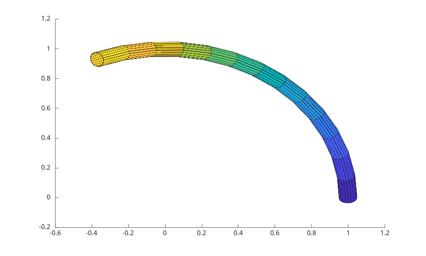

# streamtube

Afficher des chemins de courant avec un style tube.

## 📝 Syntaxe

- streamtube(U, V, W, sx, sy, sz)
- streamtube(X, Y, Z, U, V, W, sx, sy, sz)
- streamtube(vertices)
- streamtube(vertices, width)
- h = streamtube(...)

## 📄 Description

<b>streamtube</b> affiche des chemins de courant 3-D sous forme de surfaces tube.

<b>streamtube(vertices)</b> utilise des sommets de lignes de courant pre-calcules. Les handles retournes sont des objets surface.

## 💡 Exemple

Afficher un chemin avec un style tube.

```matlab
t = 0:.15:2;
vertices = {[cos(t)' sin(t)' t']};
streamtube(vertices);
```



## 🔗 Voir aussi

[streamline](../../../graphics/1_plots/5_vector_fields/streamline.md), [streamribbon](../../../graphics/1_plots/5_vector_fields/streamribbon.md).
