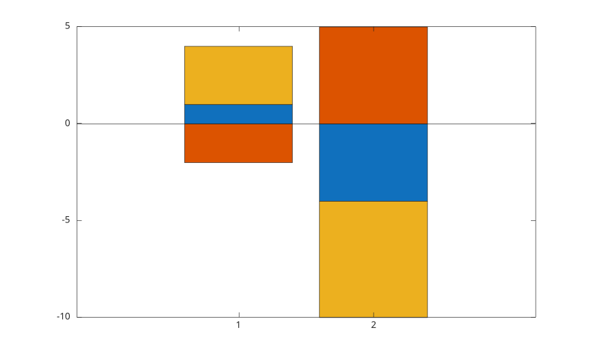
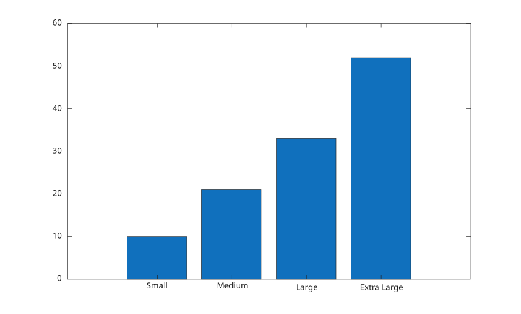
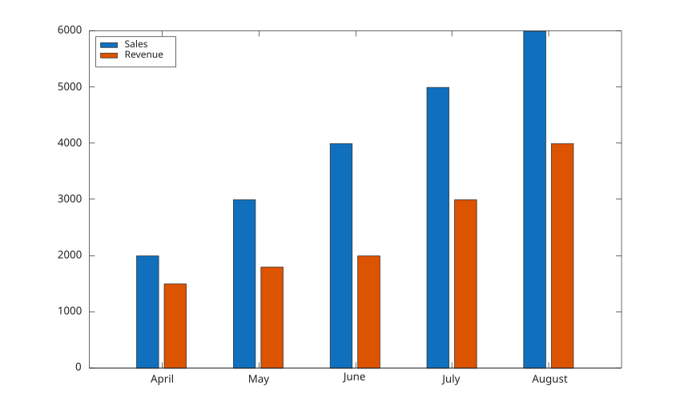

# bar

Diagramme en barres.

## 📝 Syntaxe

- bar(Y)
- bar(X, Y)
- bar(..., width)
- bar(..., color)
- bar(..., 'grouped')
- bar(..., 'stacked')
- bar(..., propertyName, propertyValue)
- bar(ax, ...)
- b = bar(...)

## 📥 Argument d'entrée

- X - abscisses : scalaire, vecteur, tableau categorical, tableau de chaines ou cellule d'etiquettes.
- Y - ordonnees : vecteur ou matrice.
- width - scalaire, 0.8 par defaut.
- color - chaine scalaire ou vecteur ligne de caracteres : nom de couleur ou nom court de couleur.
- propertyName - chaine scalaire ou vecteur ligne de caracteres.
- propertyValue - une valeur.
- ax - objet axes.

## 📤 Argument de sortie

- b - objet graphique bar ou vecteur d'objets graphiques bar.

## 📄 Description


<b>bar(X, Y)</b> cree un diagramme en barres avec les positions X et les valeurs Y. 

Lorsqu'un seul argument est fourni, <b>bar(Y)</b> genere les positions X de 1 au nombre de lignes de Y. 

Vous pouvez specifier la largeur des barres. Une valeur de 1.0 fait toucher les barres voisines, tandis que la largeur par defaut vaut 0.8. 

Lorsque Y est une matrice, <b>bar</b> cree des barres groupees par defaut. Utiliser <b>'stacked'</b> pour empiler les colonnes dans chaque groupe. 

Lorsque X est un tableau categoriel, les barres sont placees dans l'ordre des categories (celui renvoye par <b>categories</b>), Y est reordonne en consequence, et les noms des categories servent d'etiquettes de graduation. 

Voir [proprietes de bar](../../../graphics/2_graphics_objects/4_properties/nelson.graphics.bar.properties.md) pour la liste complete des proprietes.

## 💡 Exemples

Diagramme en barres depuis un vecteur.

```matlab
f = figure();
y = [91 75 123.5 105 150 131 203 179 249 226 281.5];
bar(y);

```

Diagramme avec des barres plus etroites.

```matlab
f = figure();
y = [91 75 123.5 105 150 131 203 179 249 226 281.5];
bar(y, 0.5);

```

Diagramme avec positions explicites et couleur.

```matlab
f = figure();
x = 1900:10:2000;
y = [75 91 105 123.5 131 150 179 203 226 249 281.5];
bar(x, y, 'r');

```

Diagramme avec etiquettes de chaines.

```matlab
f = figure();
x = ["Summer", "Spring", "Winter", "Autumn"];
y = [2 1 4 3];
bar(x, y);

```

Diagramme avec proprietes de face et de contour.

```matlab
f = figure();
y = [91 75 123.5 105 150 131 203 179 249 226 281.5];
bar(y, 'FaceColor', [0 .5 .5], 'EdgeColor', [0 .9 .9], 'LineWidth', 1.5);

```

Barres groupees.

```matlab
f = figure();
y = [1 2; 3 4; 5 6];
bar(y, 'grouped');

```

Barres empilees avec valeurs positives et negatives.

```matlab
f = figure();
y = [1 -2 3; -4 5 -6];
bar(y, 'stacked');

```

Barres empilees a une position scalaire.

```matlab
f = figure();
x = 2020;
y = [30 50 23];
bar(x, y, "stacked");

```

Diagramme avec etiquettes categoriales.

```matlab
f = figure();
X = categorical({'Small', 'Medium', 'Large', 'Extra Large'});
X = reordercats(X, {'Small', 'Medium', 'Large', 'Extra Large'});
Y = [10 21 33 52];
bar(X, Y);

```

Diagramme depuis une variable de table.

```matlab
f = figure();
Month = ["April"; "May"; "June"; "July"; "August"];
Sales = [2000; 3000; 4000; 5000; 6000];
Revenue = [1500; 1800; 2000; 3000; 4000];
tbl = table(Month, Sales, Revenue);
bar(tbl.Month, tbl.Sales);

```

Barres groupees depuis plusieurs variables de table.

```matlab
f = figure();
Month = ["April"; "May"; "June"; "July"; "August"];
Sales = [2000; 3000; 4000; 5000; 6000];
Revenue = [1500; 1800; 2000; 3000; 4000];
tbl = table(Month, Sales, Revenue);
bar(tbl.Month, [tbl.Sales, tbl.Revenue]);
legend({'Sales', 'Revenue'}, 'Location', 'northwest');

```



## 🔗 Voir aussi

[proprietes de bar](../../../graphics/2_graphics_objects/4_properties/nelson.graphics.bar.properties.md), [hist](../../../graphics/1_plots/4_data_distribution_plots/hist.md), [barh](../../../graphics/1_plots/6_discrete_data_plots/barh.md), [bar3](../../../graphics/1_plots/6_discrete_data_plots/bar3.md).

## 🕔 Historique

| Version | 📄 Description     |
| ------- | --------------- |
| 1.0.0   | version initiale |
| 1.12.0   | Gestion du nom de couleur ou du nom court de couleur. |

<!--
## 👤 Auteur

Allan CORNET
-->
