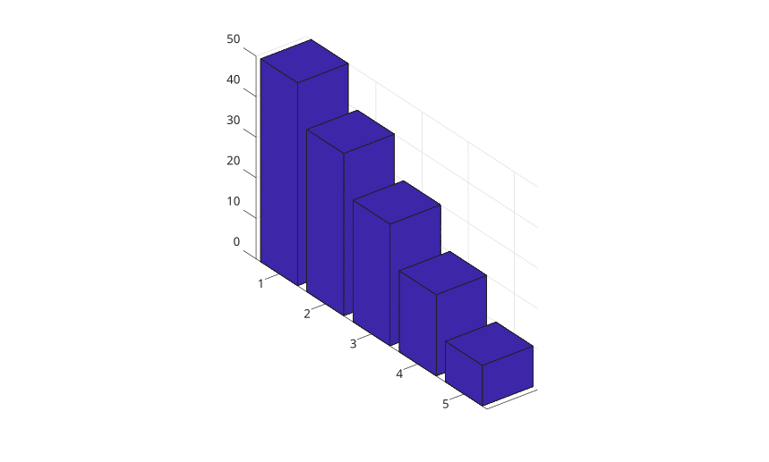
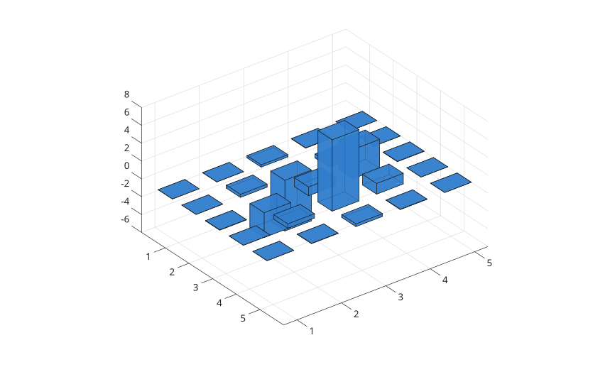

# bar3

Afficher un diagramme en barres verticales 3-D.

## 📝 Syntaxe

- bar3(Y)
- bar3(Z, Y)
- bar3(..., width)
- bar3(..., 'detached')
- bar3(..., 'grouped')
- bar3(..., 'stacked')
- bar3(..., color)
- bar3(parent, ...)
- h = bar3(...)

## 📥 Argument d'entrée

- Y - Vecteur ou matrice numerique des hauteurs de barres.
- Z - positions des lignes de barres.
- width - Largeur relative des barres. La valeur par defaut est 0.8.
- color - nom de couleur ou nom court de couleur pour les faces.

## 📤 Argument de sortie

- h - objet graphique surface ou vecteur d'objets graphiques surface.

## 📄 Description


<b>bar3</b> affiche les colonnes sous forme de cuboides 3-D. Les colonnes de la matrice sont placees selon x et les lignes selon y. 

Utiliser <b>'grouped'</b> pour grouper les colonnes de matrice a chaque position de ligne et <b>'stacked'</b> pour les empiler.

## 💡 Exemples

Barres 3-D detachees depuis une matrice.

```matlab
f = figure();
Y = [1 2 3; 4 5 6];
bar3(Y);

```

Barres 3-D depuis un vecteur.

```matlab
f = figure();
z = [50 40 30 20 10];
bar3(z);

```

Barres 3-D avec positions de lignes explicites.

```matlab
f = figure();
z = [1950 1960 1970 1980 1990];
y = [16 8 4 2 1];
bar3(z, y);

```

Barres 3-D groupees.

```matlab
f = figure();
y = [1 2; 3 4; 5 6];
bar3(y, 'grouped');

```

Barres 3-D empilees avec valeurs positives et negatives.

```matlab
f = figure();
y = [1 -2; -3 4];
bar3(y, 'stacked');

```

Definir la couleur et la transparence.

```matlab
f = figure();
h = bar3(peaks(5), 0.6);
set(h, 'FaceColor', [0.2 0.5 0.8], 'FaceAlpha', 0.8);

```



## 🔗 Voir aussi

[bar](../../../graphics/1_plots/6_discrete_data_plots/bar.md), [bar3h](../../../graphics/1_plots/6_discrete_data_plots/bar3h.md), [surface](../../../graphics/1_plots/7_surfaces_volumes_polygons/surface.md).