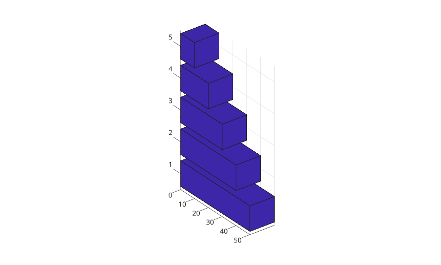
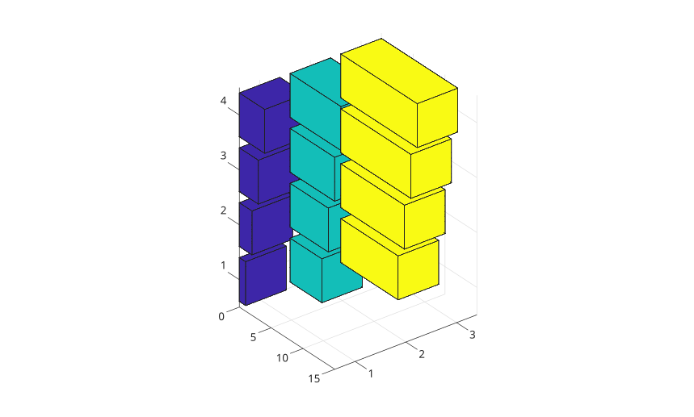
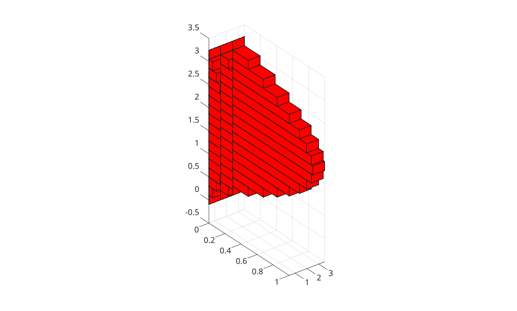
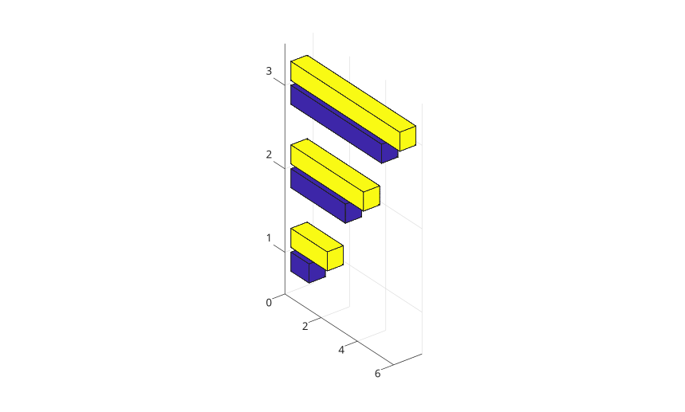
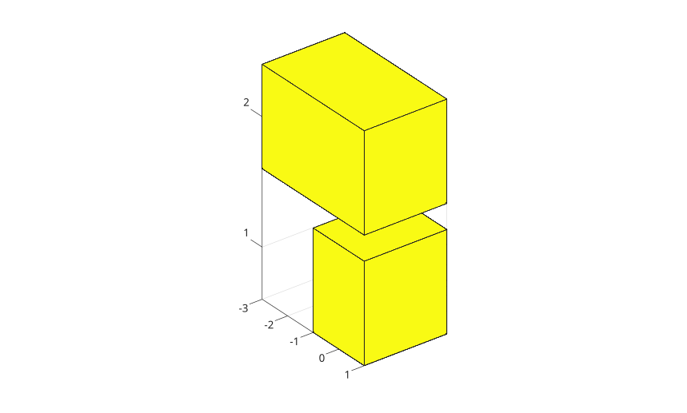

# bar3h

Afficher un diagramme en barres horizontales 3-D.

## 📝 Syntaxe

- bar3h(Y)
- bar3h(Z, Y)
- bar3h(..., width)
- bar3h(..., 'detached')
- bar3h(..., 'grouped')
- bar3h(..., 'stacked')
- bar3h(..., color)
- bar3h(parent, ...)
- h = bar3h(...)

## 📥 Argument d'entrée

- Y - Vecteur ou matrice numerique des longueurs de barres.
- Z - positions des lignes de barres.
- width - Largeur relative des barres. La valeur par defaut est 0.8.
- color - nom de couleur ou nom court de couleur pour les faces.

## 📤 Argument de sortie

- h - objet graphique surface ou vecteur d'objets graphiques surface.

## 📄 Description


<b>bar3h</b> affiche des barres 3-D horizontales qui partent de x = 0. 

Utiliser <b>'grouped'</b> pour grouper les colonnes de matrice a chaque position de ligne et <b>'stacked'</b> pour les empiler.

## 💡 Exemples

Barres horizontales 3-D detachees depuis une matrice.

```matlab
f = figure();
Y = [1 3; 2 4; 5 2];
bar3h(Y);

```

Barres horizontales 3-D depuis un vecteur.

```matlab
f = figure();
y = [50 40 30 20 10];
bar3h(y);

```

Barres horizontales 3-D avec positions explicites.

```matlab
f = figure();
z = [1950 1960 1970 1980 1990];
y = [16 8 4 2 1];
bar3h(z, y);

```

Barres horizontales 3-D depuis une matrice.

```matlab
f = figure();
y = [1 4 7; 2 5 8; 3 6 9; 4 7 10];
bar3h(y);

```

Barres horizontales 3-D depuis une matrice avec positions explicites.

```matlab
f = figure();
z = [1 2 3 4];
y = [1 5 9; 2 6 10; 3 7 11; 4 8 12];
bar3h(z, y);

```

Barres horizontales 3-D avec largeur et couleur.

```matlab
f = figure();
z = 0:pi/16:pi;
y = [sin(z') / 4, sin(z') / 2, sin(z')];
bar3h(z, y, 1, "r");

```

Barres horizontales 3-D groupees.

```matlab
f = figure();
y = [1 2; 3 4; 5 6];
bar3h(y, 'grouped');

```

Barres horizontales 3-D empilees avec valeurs positives et negatives.

```matlab
f = figure();
y = [1 -2; -3 4];
bar3h(y, 'stacked');

```



## 🔗 Voir aussi

[barh](../../../graphics/1_plots/6_discrete_data_plots/barh.md), [bar3](../../../graphics/1_plots/6_discrete_data_plots/bar3.md), [surface](../../../graphics/1_plots/7_surfaces_volumes_polygons/surface.md).