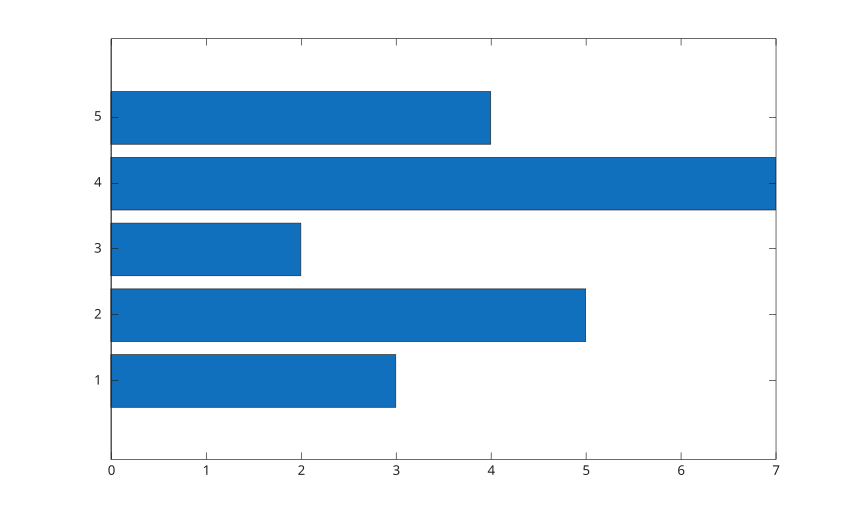
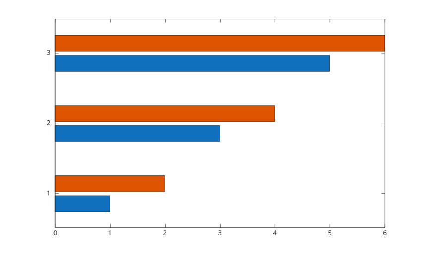
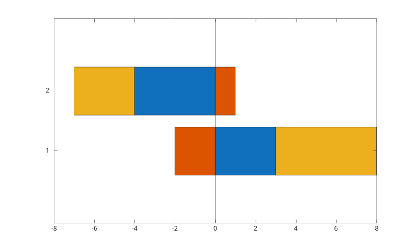

# barh

Diagramme en barres horizontales.

## 📝 Syntaxe

- barh(Y)
- barh(X, Y)
- barh(..., width)
- barh(..., color)
- barh(..., 'grouped')
- barh(..., 'stacked')
- barh(tbl, yvar)
- barh(tbl, xvar, yvar)
- barh(..., propertyName, propertyValue)
- barh(ax, ...)
- b = barh(...)

## 📥 Argument d'entrée

- X - positions des barres : scalaire, vecteur, tableau categorical, tableau de chaines ou cellule d'etiquettes.
- Y - valeurs des barres : vecteur ou matrice.
- width - largeur des barres, scalaire, 0.8 par defaut.
- color - nom de couleur ou nom court de couleur.
- tbl - table ou timetable contenant les variables tracees.
- xvar - variable de table utilisee pour les positions ou les etiquettes des barres.
- yvar - une ou plusieurs variables numeriques de table utilisees pour les valeurs.
- propertyName - nom d'une propriete de l'objet bar.
- propertyValue - valeur d'une propriete de l'objet bar.
- ax - objet axes cible.

## 📤 Argument de sortie

- b - objet graphique bar ou vecteur d'objets graphiques bar.

## 📄 Description


<b>barh</b> cree un diagramme en barres horizontales. Une matrice cree des barres groupees par defaut. Utiliser <b>'stacked'</b> pour empiler les colonnes dans chaque groupe. 

Avec une table, selectionner une variable pour les etiquettes ou positions et une ou plusieurs variables numeriques pour les valeurs.

## 💡 Exemples

Diagramme horizontal depuis un vecteur.

```matlab
f = figure();
y = [3 5 2 7 4];
barh(y);

```

Barres horizontales groupees.

```matlab
f = figure();
y = [1 2; 3 4; 5 6];
barh(y, 'grouped');

```

Barres horizontales empilees avec valeurs positives et negatives.

```matlab
f = figure();
y = [3 -2 5; -4 1 -3];
barh(y, 'stacked');

```



## 🔗 Voir aussi

[bar](../../../graphics/1_plots/6_discrete_data_plots/bar.md), [bar3h](../../../graphics/1_plots/6_discrete_data_plots/bar3h.md).
<!--
## 👤 Auteur

Allan CORNET
-->
