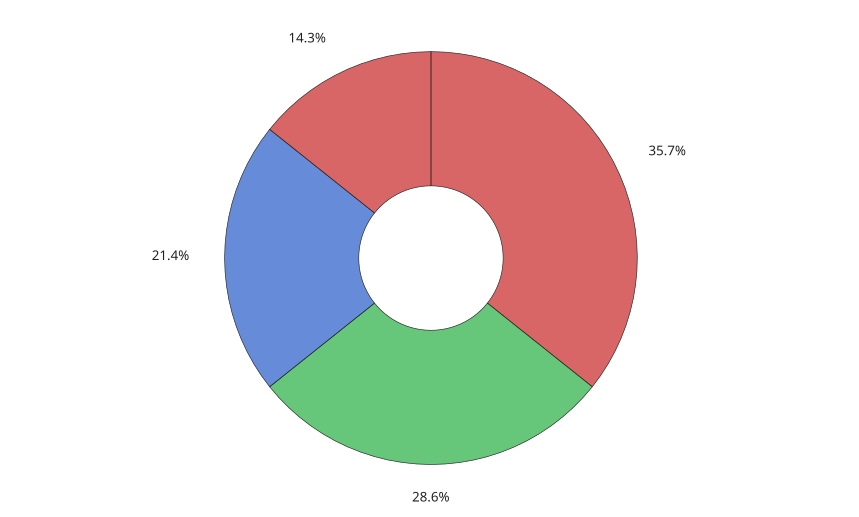

# donutchart

Objet graphique en anneau.

## 📝 Syntaxe

- donutchart(data)
- donutchart(data, names)
- donutchart(fig, ...)
- donutchart(..., propertyName, propertyValue)
- d = donutchart(...)

## 📥 Argument d'entrée

- data - Vecteur numerique des valeurs des secteurs.
- names - Tableau de chaines, chaine de caracteres ou cellule de chaines utilisee comme noms des secteurs.
- fig - Figure parente.
- propertyName - Nom de propriete du graphique.
- propertyValue - Valeur assignee a la propriete nommee.

## 📤 Argument de sortie

- d - Objet graphique donutchart.

## 📄 Description

<b>donutchart(data)</b> cree un objet graphique en anneau dans la figure courante.

<b>InnerRadius</b> controle le rayon du trou comme fraction du rayon externe. <b>CenterLabel</b> affiche un texte au centre de l'anneau.

Voir [proprietes de donutchart](../../../graphics/2_graphics_objects/4_properties/nelson.graphics.donutchart.properties.md) pour la liste complete des proprietes.

## 💡 Exemples

Graphique en anneau avec texte central.

```matlab
figure('Color', [1 1 1]);
d = donutchart([4 3 2], ["A", "B", "C"], 'CenterLabel', '9');
```


Rayon interne et couleurs personnalises.

```matlab
figure('Color', [1 1 1]);
d = donutchart([5 4 3 2], 'InnerRadius', 0.35, 'FaceAlpha', 0.75, ...
  'ColorOrder', [0.8 0.2 0.2; 0.2 0.7 0.3; 0.2 0.4 0.8]);
```



## 🔗 Voir aussi

[proprietes de donutchart](../../../graphics/2_graphics_objects/4_properties/nelson.graphics.donutchart.properties.md), [piechart](../../../graphics/1_plots/6_discrete_data_plots/piechart.md), [pie](../../../graphics/1_plots/6_discrete_data_plots/pie.md).

## 🕔 Historique

| Version | 📄 Description   |
| ------- | ---------------- |
| 2.0.0   | version initiale |

<!--
## 👤 Auteur

Allan CORNET
-->
