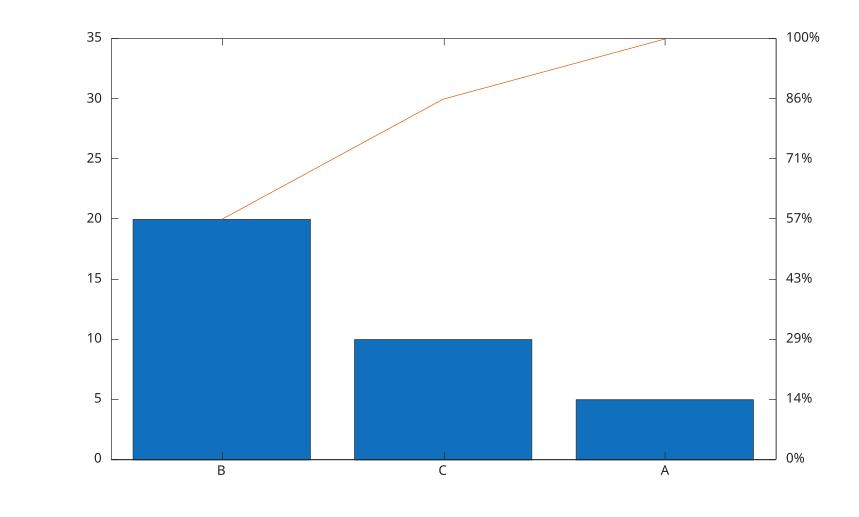

# pareto

Afficher un diagramme de Pareto.

## 📝 Syntaxe

- pareto(y)
- pareto(y, threshold)
- pareto(y, labels)
- pareto(y, labels, threshold)
- pareto(parent, ...)
- h = pareto(...)

## 📄 Description


<b>pareto</b> trie des valeurs positives ou nulles par ordre decroissant, affiche les barres et superpose une ligne cumulative. <b>threshold</b> est un scalaire entre 0 et 1 qui controle le nombre de labels tries affiches.

## 💡 Exemple

Creer un diagramme de Pareto.

```matlab
pareto([5 20 10], {'A', 'B', 'C'});
```



## 🔗 Voir aussi

[bar](../../../graphics/1_plots/6_discrete_data_plots/bar.md), [plot](../../../graphics/1_plots/1_line_plots/plot.md).