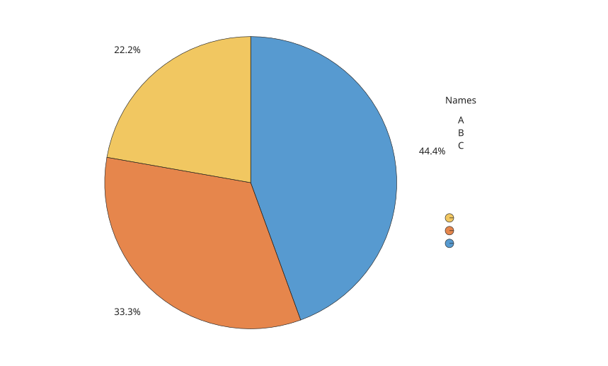
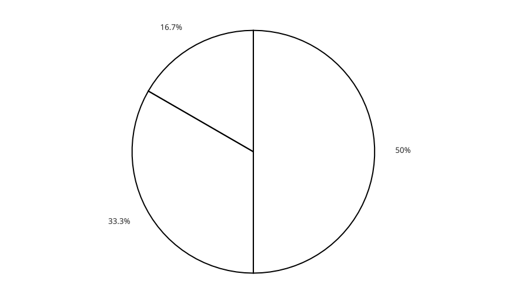

# piechart

Objet graphique en secteurs.

## 📝 Syntaxe

- piechart(data)
- piechart(data, names)
- piechart(fig, ...)
- piechart(..., propertyName, propertyValue)
- p = piechart(...)

## 📥 Argument d'entrée

- data - Vecteur numerique des valeurs des secteurs. Les valeurs negatives, infinies et NaN sont ignorees pour l'affichage.
- names - Tableau de chaines, chaine de caracteres ou cellule de chaines utilisee comme noms des secteurs.
- fig - Figure parente.
- propertyName - Nom de propriete du graphique.
- propertyValue - Valeur assignee a la propriete nommee.

## 📤 Argument de sortie

- p - Objet graphique piechart.

## 📄 Description

<b>piechart(data)</b> cree un objet graphique en secteurs dans la figure courante.

L'objet expose les proprietes de donnees, etiquettes, couleurs, traits, police, legende, visibilite, disposition et ordre d'affichage. Les valeurs affichees sont recalculees quand les donnees ou les proprietes d'affichage changent.

<b>FaceColor</b> peut valoir <b>flat</b>, <b>none</b> ou une couleur RGB. <b>FaceAlpha</b>, <b>EdgeColor</b> et <b>LineWidth</b> modifient le rendu des secteurs. <b>Proportions</b>, <b>CategoryCounts</b>, <b>WedgeDisplayData</b> et <b>WedgeDisplayNames</b> sont des proprietes derivees en lecture seule.

Voir [proprietes de piechart](../../../graphics/2_graphics_objects/4_properties/nelson.graphics.piechart.properties.md) pour la liste complete des proprietes.

## 💡 Exemples

Graphique en secteurs avec etiquettes en pourcentage.

```matlab
figure('Color', [1 1 1]);
p = piechart([1 2 3 4]);
```


Secteurs nommes avec legende.

```matlab
figure('Color', [1 1 1]);
p = piechart([4 3 2], ["A", "B", "C"], 'LegendVisible', 'on', ...
  'LegendTitle', 'Names', 'FaceAlpha', 0.7);
```


Secteurs sans remplissage.

```matlab
figure('Color', [1 1 1]);
p = piechart([3 2 1], 'FaceColor', 'none', 'EdgeColor', [0 0 0], ...
  'LineWidth', 2);
```



## 🔗 Voir aussi

[proprietes de piechart](../../../graphics/2_graphics_objects/4_properties/nelson.graphics.piechart.properties.md), [donutchart](../../../graphics/1_plots/6_discrete_data_plots/donutchart.md), [pie](../../../graphics/1_plots/6_discrete_data_plots/pie.md).

## 🕔 Historique

| Version | 📄 Description   |
| ------- | ---------------- |
| 2.0.0   | version initiale |

<!--
## 👤 Auteur

Allan CORNET
-->
