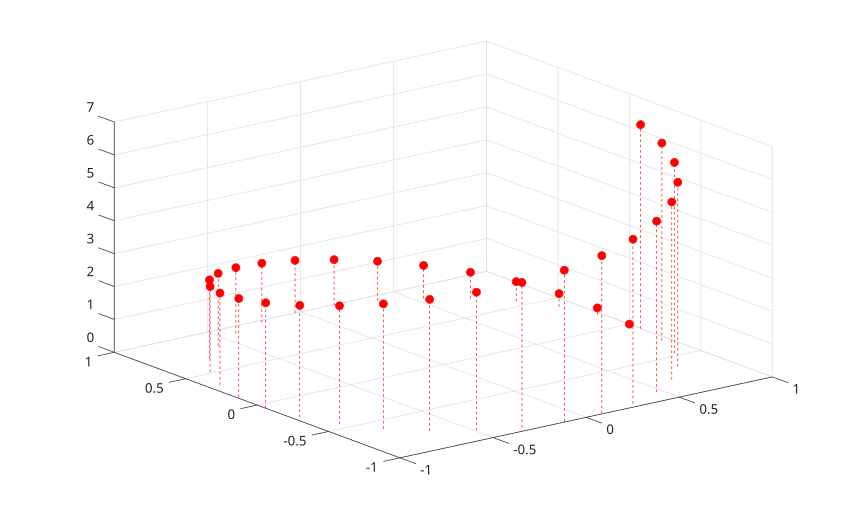

# stem3

Afficher un trace en tiges 3-D.

## 📝 Syntaxe

- stem3(Z)
- stem3(X, Y, Z)
- stem3(..., LineSpec)
- stem3(..., 'filled')
- stem3(parent, ...)
- h = stem3(...)

## 📥 Argument d'entrée

- Z - Hauteurs des tiges : vecteur ou matrice numerique.
- X - Coordonnees X : vecteur ou matrice numerique.
- Y - Coordonnees Y : vecteur ou matrice numerique.
- LineSpec - Specification de style de ligne, marqueur et couleur.
- parent - Axes ou hggroup parent.

## 📤 Argument de sortie

- h - Objet graphique stem.

## 📄 Description

<b>stem3</b> affiche des tiges verticales de z = 0 aux valeurs de <b>Z</b>, avec des marqueurs aux sommets.

L'objet retourne est un objet graphique <b>stem</b>. Voir [nelson.graphics.stem.properties](../../../graphics/2_graphics_objects/4_properties/nelson.graphics.stem.properties.md) pour les proprietes prises en charge.

## 💡 Exemples

Afficher un trace en tiges 3-D depuis une matrice.

```matlab
Z = peaks(8);
stem3(Z);
```


Specifier les coordonnees et remplir les marqueurs.

```matlab
t = 0:0.2:2*pi;
stem3(cos(t), sin(t), t, 'r--', 'filled');
```



## 🔗 Voir aussi

[stem](../../../graphics/1_plots/6_discrete_data_plots/stem.md), [plot3](../../../graphics/1_plots/1_line_plots/plot3.md), [nelson.graphics.stem.properties](../../../graphics/2_graphics_objects/4_properties/nelson.graphics.stem.properties.md).
