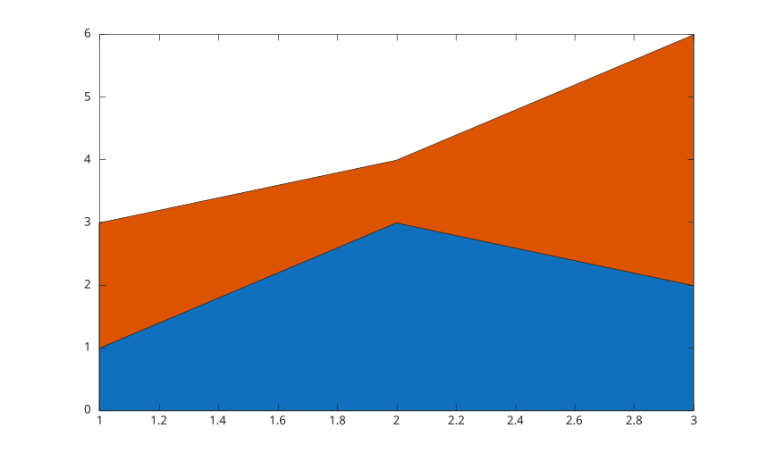

# area

Creer des graphes d'aires.

## 📝 Syntaxe

- area(Y)
- area(X, Y)
- area(..., basevalue)
- area(..., propertyName, propertyValue)
- area(ax, ...)
- go = area(...)

## 📥 Argument d'entrée

- X - Coordonnees x.
- Y - Donnees d'aire. Les colonnes d'une matrice creent des objets area empiles.
- basevalue - Valeur de base. Par defaut : 0.

## 📤 Argument de sortie

- go - Handles graphiques de type area.

## 📄 Description

<b>area</b> cree un objet graphique area natif par colonne de donnees. Les objets area utilisent un rendu par polygones remplis et acceptent les proprietes de face, bord, ligne, alpha, valeur de base et interaction.

Voir [proprietes de area](../../../graphics/2_graphics_objects/4_properties/nelson.graphics.area.properties.md) pour la liste complete des proprietes.

## 💡 Exemple

```matlab
y = [1 2; 3 1; 2 4];
area(y);
```



## 🔗 Voir aussi

[proprietes de area](../../../graphics/2_graphics_objects/4_properties/nelson.graphics.area.properties.md), [fill](../../../graphics/1_plots/7_surfaces_volumes_polygons/fill.md), [patch](../../../graphics/1_plots/7_surfaces_volumes_polygons/patch.md).

<!--
## 👤 Auteur

Allan CORNET
-->
