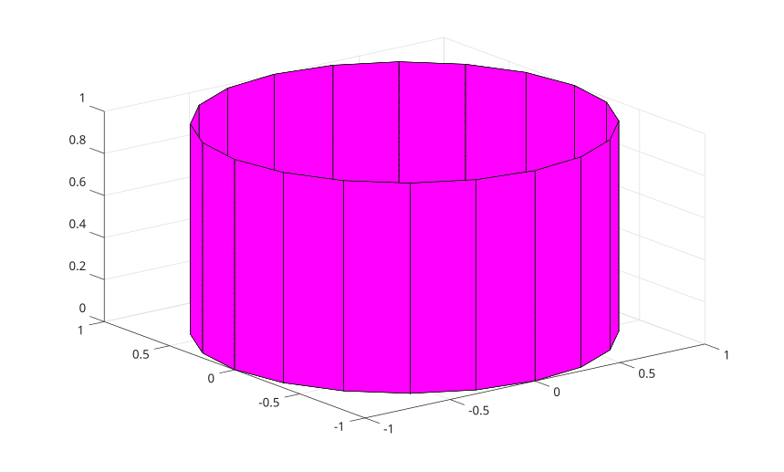
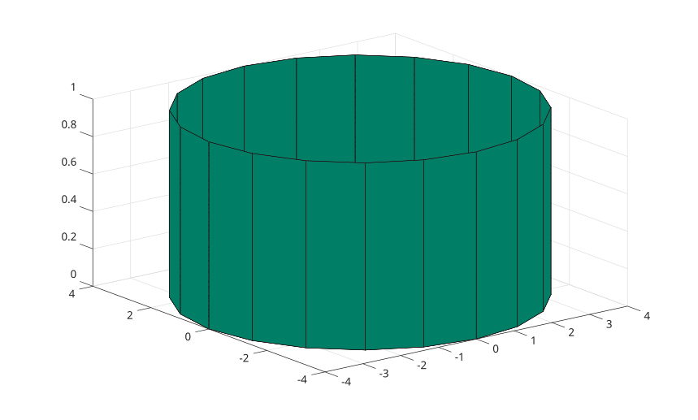

# cylinder

Créer un cylindre.

## 📝 Syntaxe

- [X, Y, Z] = cylinder()
- [X, Y, Z] = cylinder(r)
- [X, Y, Z] = cylinder(r, n)
- cylinder()
- cylinder(r)
- cylinder(r, n)
- cylinder(ax, ...)

## 📥 Argument d'entrée

- r - Courbe de profil : vecteur.
- n - Nombre de points : entier positif.
- ax - Axes cibles : objet 'axes'.

## 📤 Argument de sortie

- X, Y, Z - Coordonnées x, y et z d'un cylindre sans l'afficher.

## 📄 Description

<b>cylinder</b> crée un cylindre et l'affiche.

## 💡 Exemples

```matlab
f1 = figure();
colormap(spring)
cylinder()
```



```matlab
f2 = figure();
colormap(summer)
r = 4;
cylinder(r);
```



## 🔗 Voir aussi

[sphere](../../../graphics/1_plots/7_surfaces_volumes_polygons/sphere.md), [surf](../../../graphics/1_plots/7_surfaces_volumes_polygons/surf.md).

## 🕔 Historique

| Version | 📄 Description   |
| ------- | ---------------- |
| 1.0.0   | version initiale |

<!--
## 👤 Auteur

Allan CORNET
-->
