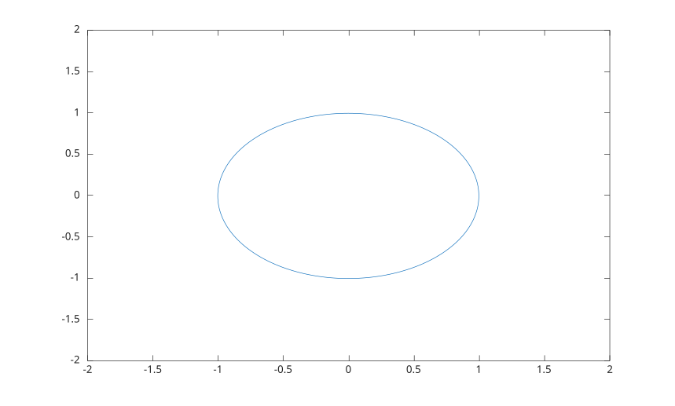

# fimplicit

Tracer une courbe de fonction implicite.

## 📝 Syntaxe

- fimplicit(fun)
- fimplicit({fun1, fun2, ...})
- fimplicit(fun, interval)
- fimplicit(fun, [xmin xmax ymin ymax])
- fimplicit(..., LineSpec)
- fimplicit(..., nomPropriete, valeurPropriete)
- fimplicit(parent, ...)
- h = fimplicit(...)

## 📄 Description


<b>fimplicit</b> echantillonne <b>fun(x,y)</b> et trace le contour de niveau zero comme objet graphique <b>implicitfunctionline</b>. 

Quand un tableau de cellules de fonctions est fourni, un objet <b>implicitfunctionline</b> est cree pour chaque fonction et le tableau de handles retourne est un vecteur colonne. 

Voir [proprietes de implicitfunctionline](../../../graphics/2_graphics_objects/4_properties/nelson.graphics.implicitfunctionline.properties.md) pour la liste complete des proprietes.

## 💡 Exemples

Tracer un cercle unite.

```matlab
fimplicit(@(x, y) x.^2 + y.^2 - 1, [-2 2 -2 2]);
```

Utiliser un style de ligne et des proprietes de ligne.

```matlab
h = fimplicit(@(x, y) x.^2 + y.^2 - 1, [-2 2], '--r', 'LineWidth', 2);
```

Tracer deux courbes implicites.

```matlab
f1 = @(x, y) x.^2 + y.^2 - 1;
f2 = @(x, y) x - y;
h = fimplicit({f1, f2});
```


## 🔗 Voir aussi

[proprietes de implicitfunctionline](../../../graphics/2_graphics_objects/4_properties/nelson.graphics.implicitfunctionline.properties.md), [fcontour](../../../graphics/1_plots/3_contour_plots/fcontour.md), [contour](../../../graphics/1_plots/3_contour_plots/contour.md).