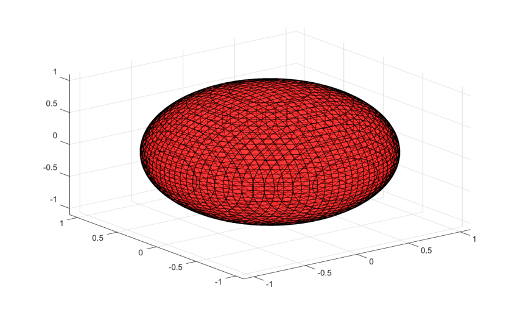

# fimplicit3

Tracer une approximation de surface implicite 3-D.

## 📝 Syntaxe

- fimplicit3(fun)
- fimplicit3(fun, interval)
- fimplicit3(fun, [xmin xmax ymin ymax zmin zmax])
- fimplicit3(..., LineSpec)
- fimplicit3(..., nomPropriete, valeurPropriete)
- fimplicit3(parent, ...)
- h = fimplicit3(...)

## 📄 Description

<b>fimplicit3</b> echantillonne <b>fun(x,y,z)</b> sur une grille reguliere et affiche une surface de niveau zero approchee comme objet graphique <b>implicitfunctionsurface</b>.

Voir [proprietes de implicitfunctionsurface](../../../graphics/2_graphics_objects/4_properties/nelson.graphics.implicitfunctionsurface.properties.md) pour la liste complete des proprietes.

## 💡 Exemples

Tracer une approximation de sphere.

```matlab
fimplicit3(@(x, y, z) x.^2 + y.^2 + z.^2 - 1, [-1.5 1.5]);
```


Utiliser un style de ligne et des proprietes de surface.

```matlab
h = fimplicit3(@(x, y, z) x.^2 + y.^2 + z.^2 - 1, [-1.5 1.5], 'r', 'FaceAlpha', 0.5);
```



## 🔗 Voir aussi

[proprietes de implicitfunctionsurface](../../../graphics/2_graphics_objects/4_properties/nelson.graphics.implicitfunctionsurface.properties.md), [fimplicit](../../../graphics/1_plots/7_surfaces_volumes_polygons/fimplicit.md).
