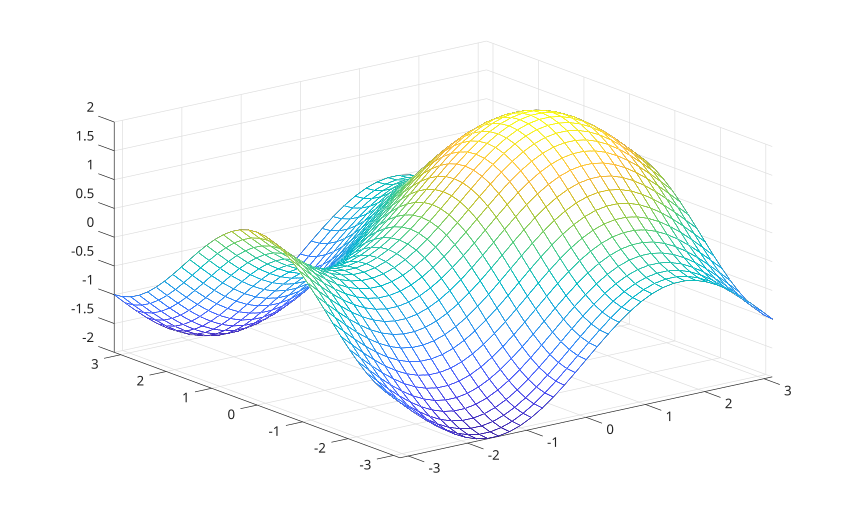

# fmesh

Tracer un maillage depuis une fonction de deux variables.

## 📝 Syntaxe

- fmesh(fun)
- fmesh(fun, xyinterval)
- fmesh(fun, [xmin xmax ymin ymax])
- fmesh(funx, funy, funz)
- fmesh(..., Nom, Valeur)
- fmesh(parent, ...)
- h = fmesh(...)

## 📄 Description


<b>fmesh</b> cree un objet graphique <b>functionsurface</b> et affiche un maillage pour une fonction de deux variables. 

La fonction peut etre indiquee sous la forme <b>fun(x,y)</b>. Une surface parametrique peut etre indiquee avec <b>funx(u,v)</b>, <b>funy(u,v)</b> et <b>funz(u,v)</b>. 

L'intervalle par defaut est <b>[-5 5 -5 5]</b>. Un intervalle a deux elements s'applique aux plages x et y. 

Voir [proprietes de functionsurface](../../../graphics/2_graphics_objects/4_properties/nelson.graphics.functionsurface.properties.md) pour la liste complete des proprietes.

## 💡 Exemples

Afficher un maillage de fonction.

```matlab
fmesh(@(x, y) sin(x) + cos(y), [-pi pi -pi pi]);
```

Utiliser un maillage plus dense et definir une propriete de ligne.

```matlab
fmesh(@(x, y) x.^2 - y.^2, [-2 2 -2 2], 'MeshDensity', 51, 'LineWidth', 1.5);
```

Afficher un maillage parametrique.

```matlab
fmesh(@(u, v) u, @(u, v) v, @(u, v) sin(u) + cos(v), [-pi pi -pi pi]);
```


## 🔗 Voir aussi

[proprietes de functionsurface](../../../graphics/2_graphics_objects/4_properties/nelson.graphics.functionsurface.properties.md), [mesh](../../../graphics/1_plots/7_surfaces_volumes_polygons/mesh.md), [fsurf](../../../graphics/1_plots/7_surfaces_volumes_polygons/fsurf.md).