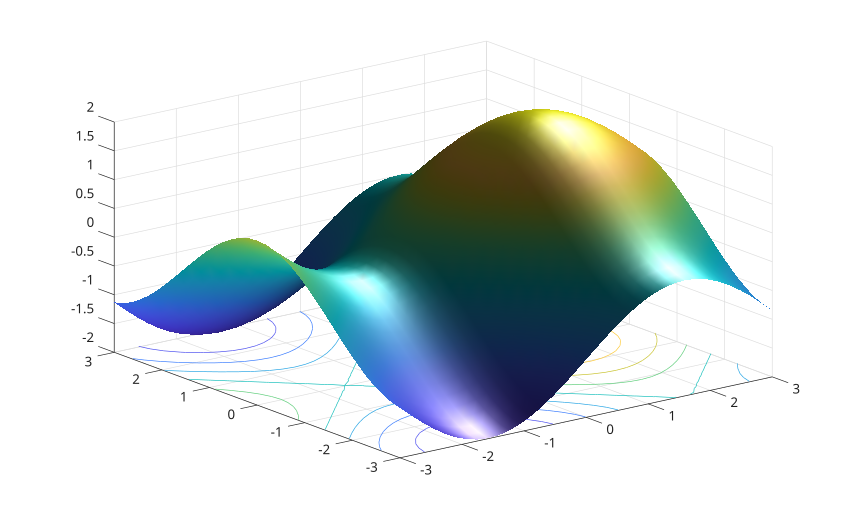

# fsurf

Trace une surface definie par une fonction.

## 📝 Syntaxe

- fsurf(fun)
- fsurf(fun, range)
- fsurf(ax, ...)
- fsurf(..., propertyName, propertyValue)
- go = fsurf(...)

## 📥 Argument d'entrée

- fun - fonction evaluee sous la forme fun(X, Y).
- range - intervalle a deux elements pour les deux axes ou [xmin xmax ymin ymax].
- MeshDensity - nombre de points d'echantillonnage dans chaque direction.
- XRange, YRange - intervalles d'echantillonnage. Modifier une plage apres la creation reevalue la surface.
- XRangeMode, YRangeMode - <b>auto</b> pour la plage par defaut, <b>manual</b> apres une affectation explicite.
- ShowContours - mettre a <b>on</b> pour ajouter des lignes de contour sous la surface.

## 📤 Argument de sortie

- go - Un objet graphique : type functionsurface.

## 📄 Description


<b>fsurf</b> echantillonne une fonction sur une grille rectangulaire et affiche une surface de type functionsurface. La grille est reevaluee quand <b>Function</b>, <b>XRange</b>, <b>YRange</b> ou <b>MeshDensity</b> change. 

Voir [proprietes de functionsurface](../../../graphics/2_graphics_objects/4_properties/nelson.graphics.functionsurface.properties.md) pour la liste complete des proprietes.

## 💡 Exemple


```matlab

fsurf(@(x, y) sin(x) + cos(y), [-3 3 -3 3], 'FaceColor', 'interp', 'EdgeColor', 'none', 'ShowContours', 'on');
light();
lighting gouraud;

```



## 🔗 Voir aussi

[proprietes de functionsurface](../../../graphics/2_graphics_objects/4_properties/nelson.graphics.functionsurface.properties.md), [surf](../../../graphics/1_plots/7_surfaces_volumes_polygons/surf.md), [surface](../../../graphics/1_plots/7_surfaces_volumes_polygons/surface.md).

## 🕔 Historique

| Version | 📄 Description     |
| ------- | --------------- |
| 2.0.0   | version initiale |

<!--
## 👤 Auteur

Allan CORNET
-->
