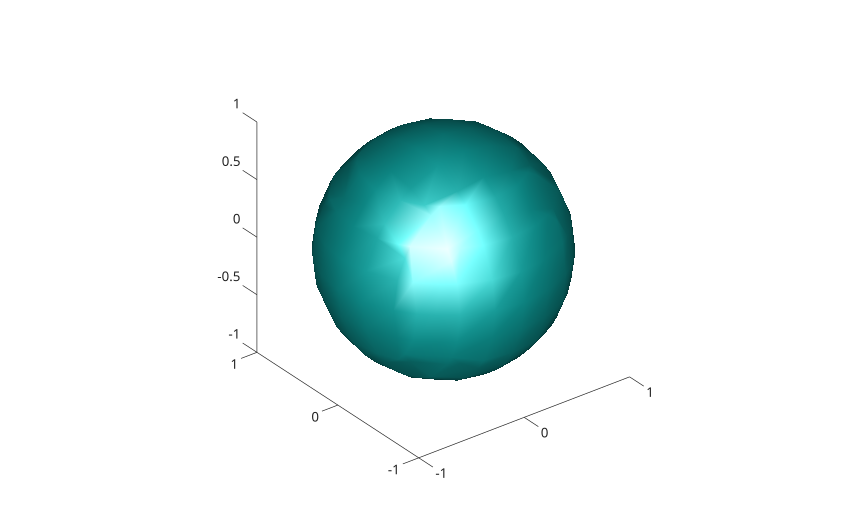

# isosurface

Extraire une isosurface depuis des donnees volumiques.

## 📝 Syntaxe

- isosurface(X, Y, Z, V, isovalue)
- s = isosurface(X, Y, Z, V, isovalue)
- s = isosurface(X, Y, Z, V)
- s = isosurface(V, isovalue)
- s = isosurface(V)
- s = isosurface(..., colors)
- s = isosurface(..., 'noshare')
- s = isosurface(..., 'verbose')
- [faces, vertices] = isosurface(...)
- [faces, vertices, colors] = isosurface(...)

## 📥 Argument d'entrée

- X, Y, Z - Vecteurs de grille ou tableaux 3-D de meme taille que V.
- V - Donnees volumiques 3-D numeriques reelles.
- isovalue - Niveau scalaire utilise pour extraire la surface. Si la valeur est omise, Nelson choisit un niveau depuis les valeurs finies.
- colors - Donnees de couleur 3-D numeriques reelles de meme taille que V.

## 📤 Argument de sortie

- s - Structure avec les champs faces et vertices, et facevertexcdata lorsque des donnees de couleur sont fournies.
- faces, vertices, colors - Connectivite triangulaire, coordonnees des sommets et valeurs de couleur interpolees.

## 📄 Description


<b>isosurface</b> extrait une surface triangulaire ou les donnees volumiques atteignent une valeur scalaire demandee. Sans argument de sortie, la surface est affichee comme un objet patch dans les axes courants. 

L'option <b>'noshare'</b> ignore la reduction des sommets partages. L'option <b>'verbose'</b> est acceptee pour compatibilite.

## 💡 Exemple

Afficher une isosurface depuis des donnees volumiques.

```matlab
[x, y, z] = meshgrid(-2:0.25:2, -2:0.25:2, -2:0.25:2);
v = x.^2 + y.^2 + z.^2;
isosurface(x, y, z, v, 1);
axis equal;
```



## 🔗 Voir aussi

[patch](../../../graphics/1_plots/7_surfaces_volumes_polygons/patch.md), [slice](../../../graphics/1_plots/7_surfaces_volumes_polygons/slice.md), [contourslice](../../../graphics/1_plots/7_surfaces_volumes_polygons/contourslice.md).