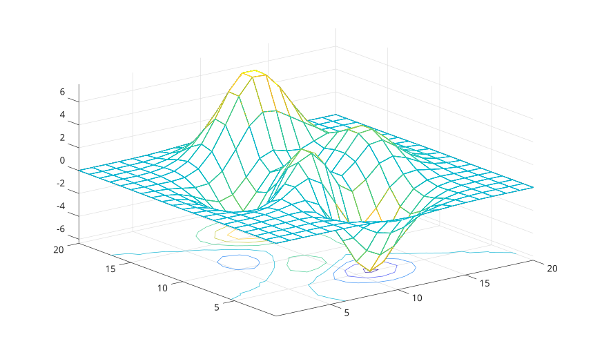

# meshc

Afficher un maillage avec des contours en dessous.

## 📝 Syntaxe

- meshc(Z)
- meshc(Z, C)
- meshc(X, Y, Z)
- meshc(X, Y, Z, C)
- meshc(parent, ...)
- meshc('Parent', parent, ...)
- h = meshc(...)

## 📄 Description


<b>meshc</b> affiche un maillage et des lignes de contour projetees a la base du maillage. 

La valeur retournee est un vecteur graphique a deux elements contenant l'objet surface puis l'objet contour.

## 💡 Exemples

Maillage avec contours.

```matlab
meshc(peaks(30));
```

Utiliser des donnees de couleur separees et des axes parents.

```matlab
f = figure();
ax = axes('Parent', f);
Z = peaks(20);
C = abs(Z);
meshc('Parent', ax, Z, C, 'LineWidth', 1.5);
```



## 🔗 Voir aussi

[mesh](../../../graphics/1_plots/7_surfaces_volumes_polygons/mesh.md), [contour3](../../../graphics/1_plots/3_contour_plots/contour3.md).