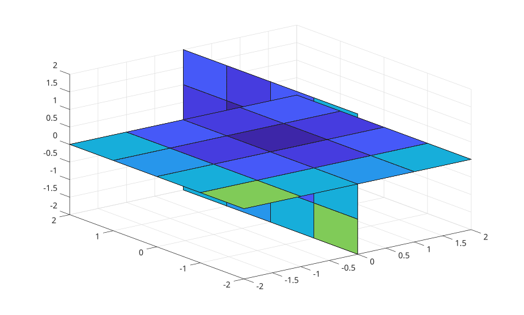

# slice

Afficher des coupes orthogonales dans des donnees volumiques.

## 📝 Syntaxe

- slice(V, xs, ys, zs)
- slice(V, XI, YI, ZI)
- slice(X, Y, Z, V, xs, ys, zs)
- slice(X, Y, Z, V, XI, YI, ZI)
- slice(..., method)
- slice(parent, ...)
- h = slice(...)

## 📥 Argument d'entrée

- V - Donnees volumiques numeriques 3-D.
- X, Y, Z - Coordonnees ou vecteurs de grille du volume.
- xs, ys, zs - Positions de coupe selon les axes x, y et z. Utiliser [] pour ignorer un axe.
- XI, YI, ZI - Tableaux definissant une surface de coupe dans le volume.
- method - Methode d'interpolation : 'linear', 'nearest' ou 'cubic'. La valeur par defaut est 'linear'.

## 📤 Argument de sortie

- h - Handles des surfaces creees pour les coupes.

## 📄 Description

<b>slice</b> echantillonne des donnees volumiques sur les plans demandes ou sur une surface demandee et affiche chaque resultat comme une surface coloree.

## 💡 Exemple

Afficher deux coupes dans un volume.

```matlab
[x, y, z] = meshgrid(-2:2, -2:2, -2:2);
v = x.^2 + y.^2 + z.^2;
slice(x, y, z, v, 0, [], 0);
```



## 🔗 Voir aussi

[surface](../../../graphics/1_plots/7_surfaces_volumes_polygons/surface.md), [contourslice](../../../graphics/1_plots/7_surfaces_volumes_polygons/contourslice.md).
