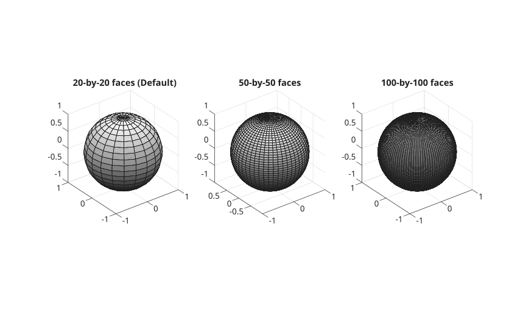

# sphere

Créer une sphère.

## 📝 Syntaxe

- [X, Y, Z] = sphere()
- [X, Y, Z] = sphere(n)
- sphere()
- sphere(n)
- sphere(ax, n)

## 📥 Argument d'entrée

- n - Nombre de points : entier positif.
- ax - Axes cibles : objet 'axes'.

## 📤 Argument de sortie

- X, Y, Z - Coordonnées x, y et z d'une sphère sans l'afficher.

## 📄 Description


<b>sphere</b> crée une sphère et l'affiche.

## 💡 Exemple


```matlab
f = figure();
colormap(gray);
subplot(1, 3, 1);
ax1 = gca();
sphere(ax1);
axis equal
title('20-by-20 faces (Default)');
subplot(1, 3, 2);
ax2 = gca();
sphere(ax2, 50);
axis equal
title('50-by-50 faces');
subplot(1, 3, 3);
ax3 = gca();
sphere(ax3,100);
axis equal
title('100-by-100 faces');
```



## 🔗 Voir aussi

[cylinder](../../../graphics/1_plots/7_surfaces_volumes_polygons/cylinder.md), [surf](../../../graphics/1_plots/7_surfaces_volumes_polygons/surf.md).

## 🕔 Historique

| Version | 📄 Description     |
| ------- | --------------- |
| 1.0.0   | version initiale |

<!--
## 👤 Auteur

Allan CORNET
-->
