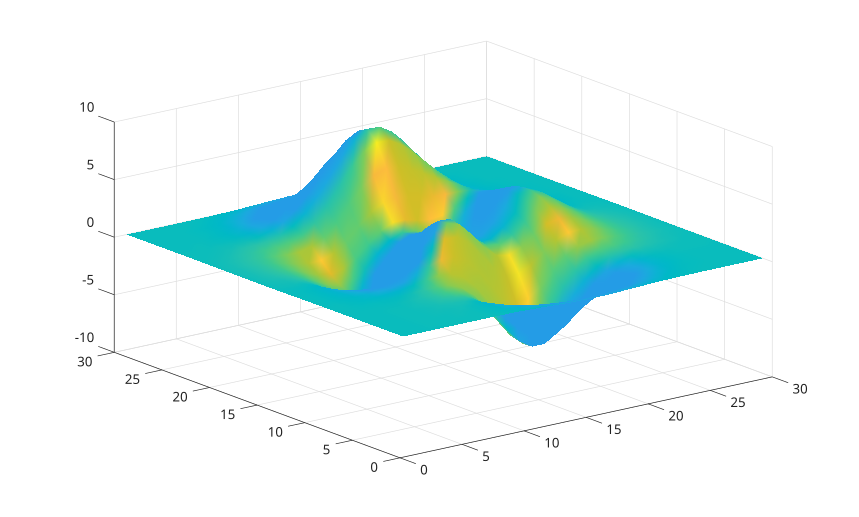

# surfl

Afficher une surface eclairee.

## 📝 Syntaxe

- surfl(Z)
- surfl(X, Y, Z)
- surfl(..., 'light')
- surfl(parent, ...)
- h = surfl(...)

## 📄 Description

<b>surfl</b> affiche une surface avec une reflectance basee sur l'eclairage stockee dans les donnees de couleur de la surface.

<b>surfl(..., 'light')</b> cree une lumiere infinie et retourne les handles de la surface et de la lumiere.

## 💡 Exemple

Surface eclairee.

```matlab
surfl(peaks(30));
shading interp;
```



## 🔗 Voir aussi

[surf](../../../graphics/1_plots/7_surfaces_volumes_polygons/surf.md), [light](../../../graphics/3_labels_styling/3_interactions_camera_lighting/light.md).
