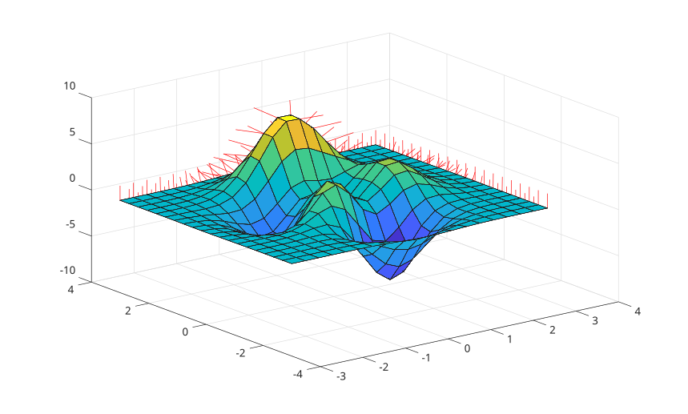

# surfnorm

Calculer ou afficher les vecteurs normaux d'une surface.

## 📝 Syntaxe

- surfnorm(Z)
- surfnorm(X, Y, Z)
- Nx = surfnorm(...)
- [Nx, Ny] = surfnorm(...)
- [Nx, Ny, Nz] = surfnorm(...)

## 📥 Argument d'entrée

- Z - Donnees de hauteur de surface, sous forme d'une matrice numerique reelle avec au moins trois lignes et trois colonnes.
- X, Y - Matrices de coordonnees de surface de meme taille que Z.

## 📤 Argument de sortie

- Nx, Ny, Nz - Composantes normalisees des vecteurs normaux a la surface.

## 📄 Description

<b>surfnorm</b> calcule les vecteurs normaux unitaires d'une surface. Sans argument de sortie, elle affiche la surface et trace un segment normal a chaque point de surface.

Lorsque seul Z est specifie, les coordonnees x et y correspondent aux indices de colonne et de ligne de Z.

## 💡 Exemples

Afficher les normales sur une surface.

```matlab
[X, Y, Z] = peaks(20);
surfnorm(X, Y, Z);
```


Calculer les composantes des vecteurs normaux.

```matlab
[Nx, Ny, Nz] = surfnorm(peaks(10));
```

## 🔗 Voir aussi

[surf](../../../graphics/1_plots/7_surfaces_volumes_polygons/surf.md), [quiver3](../../../graphics/1_plots/5_vector_fields/quiver3.md), [meshgrid](../../../elementary_functions/meshgrid.md).
