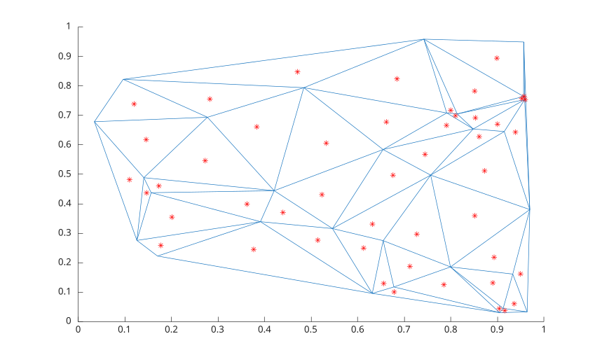

# triplot

Trace de triangles 2-D

## 📝 Syntaxe

- triplot(T, x, y)
- triplot(T, x, y, LineSpec)
- triplot(TO)
- triplot(..., Name, Value)
- h = triplot(...)

## 📄 Description


<b>triplot</b> trace un maillage triangulaire 2-D depuis une matrice de connectivite ou un objet de triangulation.

## 💡 Exemple

Tracer une triangulation et les centres inscrits de ses triangles.

```matlab
rng default;
P = rand([30 2]);
DT = delaunayTriangulation(P);
IC = incenter(DT);
triplot(DT)
hold on
plot(IC(:, 1), IC(:, 2), '*r')
```



## 🔗 Voir aussi

[delaunayTriangulation](../../../geometry/delaunayTriangulation.md), [triangulation](../../../geometry/triangulation.md), [delaunay](../../../geometry/delaunay.md).

## 🕔 Historique

| Version | 📄 Description     |
| ------- | --------------- |
| 2.0.0   | Version initiale. |

<!--
## 👤 Auteur

Allan CORNET
-->
