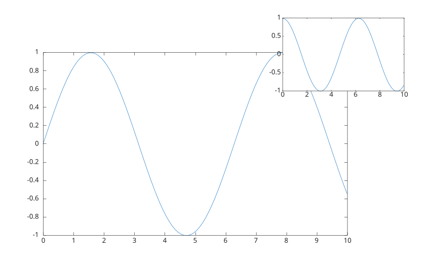

# axes

Créer des axes cartésiens.

## 📝 Syntaxe

- ax = axes()
- ax = axes(parent)
- ax = axes(propertyName, propertyValue)
- ax = axes(parent, propertyName, propertyValue)
- axes(cax)

## 📥 Argument d'entrée

- parent - une valeur scalaire d'objet graphique : conteneur parent, spécifié comme une figure.
- cax - axes à rendre courant.
- propertyName - une chaîne scalaire ou un vecteur ligne de caractères.
- propertyValue - une valeur.

## 📤 Argument de sortie

- ax - un objet graphique : type axes.

## 📄 Description

<b>axes</b> crée des axes dans la figure courante et les définit comme axes courants.

<b>axes(cax)</b> rend les axes courants.

Un clic sur un axe le rend automatiquement courant.

Voir [proprietes de axes](../../../graphics/2_graphics_objects/4_properties/nelson.graphics.axes.properties.md) pour la liste complete des proprietes.

## 💡 Exemple

```matlab
f = figure();
ax1 = axes('Position', [0.1 0.1 0.7 0.7]);
ax2 = axes('Position', [0.65 0.65 0.28 0.28]);
x = linspace(0,10);
y1 = sin(x);
y2 = cos(x);
plot(ax1, x, y1);
plot(ax2, x, y2);
```



## 🔗 Voir aussi

[proprietes de axes](../../../graphics/2_graphics_objects/4_properties/nelson.graphics.axes.properties.md), [gcf](../../../graphics/2_graphics_objects/1_object_management/gcf.md), [close](../../../graphics/2_graphics_objects/1_object_management/close.md).

## 🕔 Historique

| Version | 📄 Description                                         |
| ------- | ------------------------------------------------------ |
| 1.0.0   | version initiale                                       |
| 1.2.0   | Un clic sur un axe le rend automatiquement courant.    |
| --      | Propriétés GridAlpha, GridColor pour Axes.             |
| 1.7.0   | Ajout des callbacks CreateFcn, DeleteFcn.              |
| --      | Ajout de la propriété BeingDeleted.                    |
| --      | Mise a jour de la documentation des proprietes d'axes. |

<!--
## 👤 Auteur

Allan CORNET
-->
