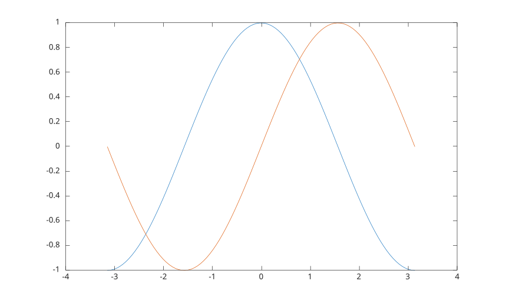

# hold

Conserver le tracé courant lors de l'ajout de nouveaux tracés.

## 📝 Syntaxe

- hold('on')
- hold('off')
- hold('all')
- hold()
- hold(ax, ...)

## 📥 Argument d'entrée

- 'on' - active le mode hold.
- 'off' - désactive le mode hold.
- 'all' - équivalent à hold on.
- ax - Axes cibles : axes.

## 📤 Argument de sortie

- ax - Un objet graphique : type axes.

## 📄 Description

<b>hold</b> permet de construire une séquence de tracés de façon incrémentale.

## 💡 Exemple

```matlab
f = figure();
x = linspace(-pi, pi);
y1 = cos(x);
plot(x, y1)
hold on
y2 = sin(x);
plot(x, y2)
hold off

```



## 🔗 Voir aussi

[ishold](../../../graphics/2_graphics_objects/1_object_management/ishold.md), [newplot](../../../graphics/2_graphics_objects/1_object_management/newplot.md).

## 🕔 Historique

| Version | 📄 Description   |
| ------- | ---------------- |
| 1.0.0   | version initiale |

<!--
## 👤 Auteur

Allan CORNET
-->
